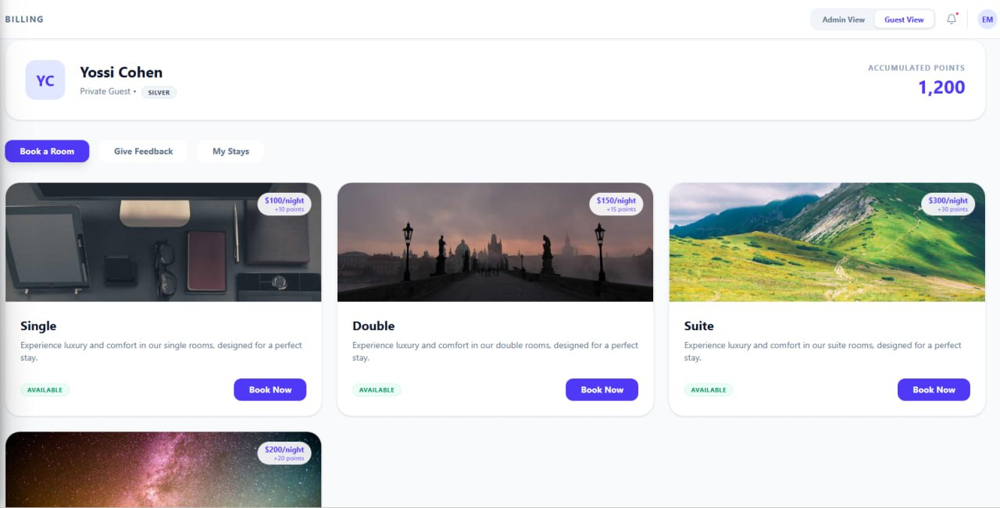
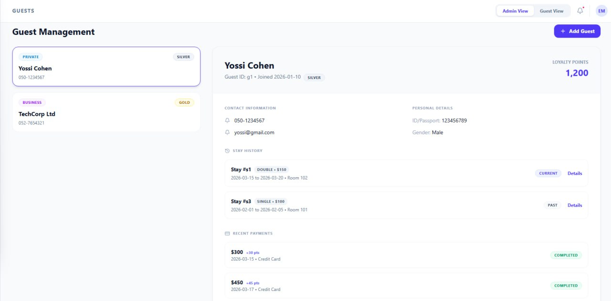
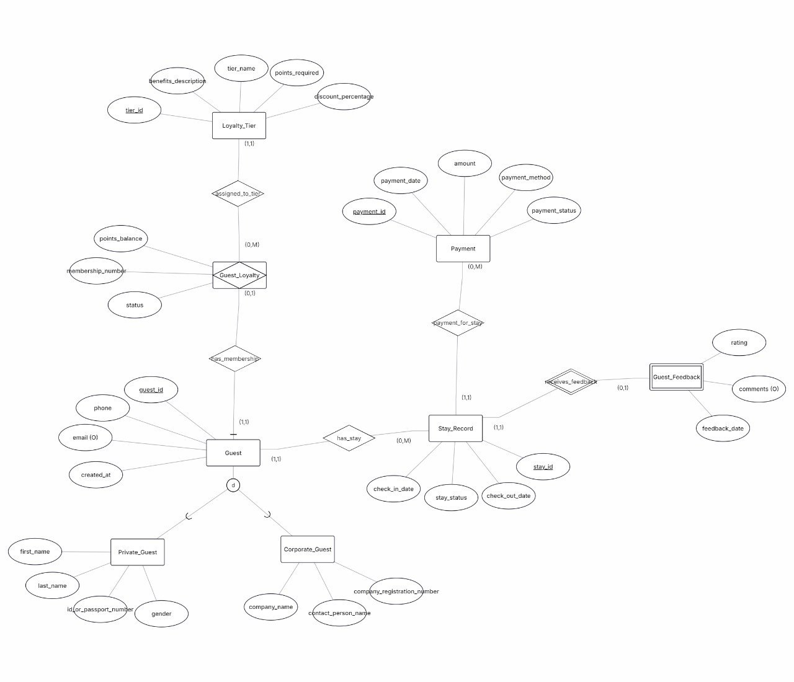
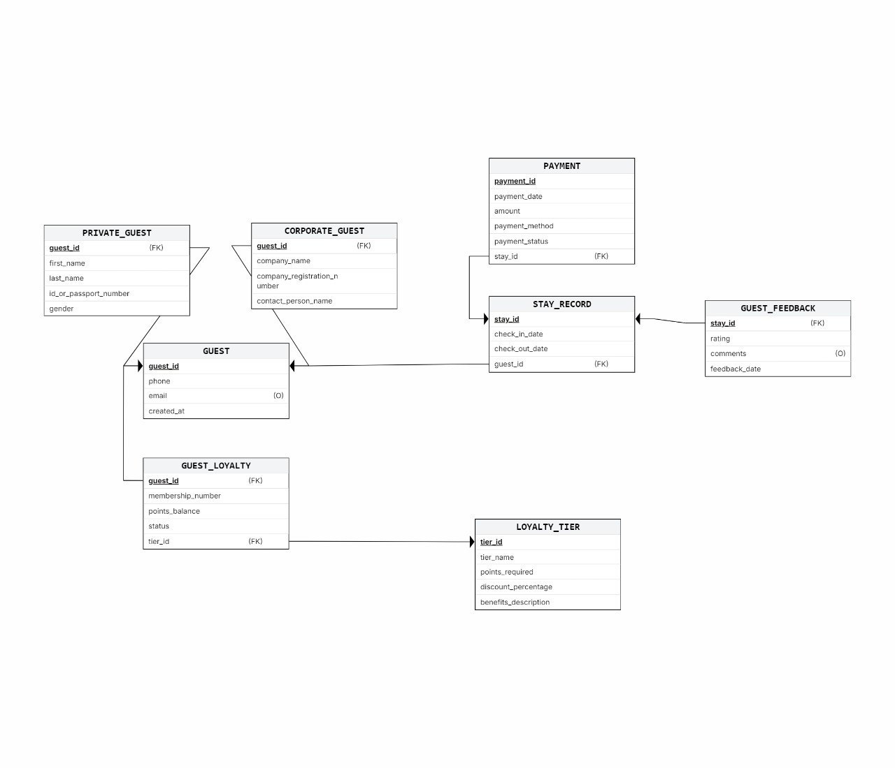
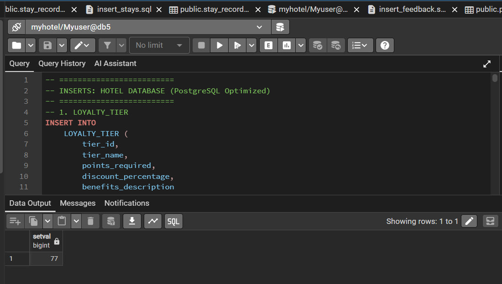
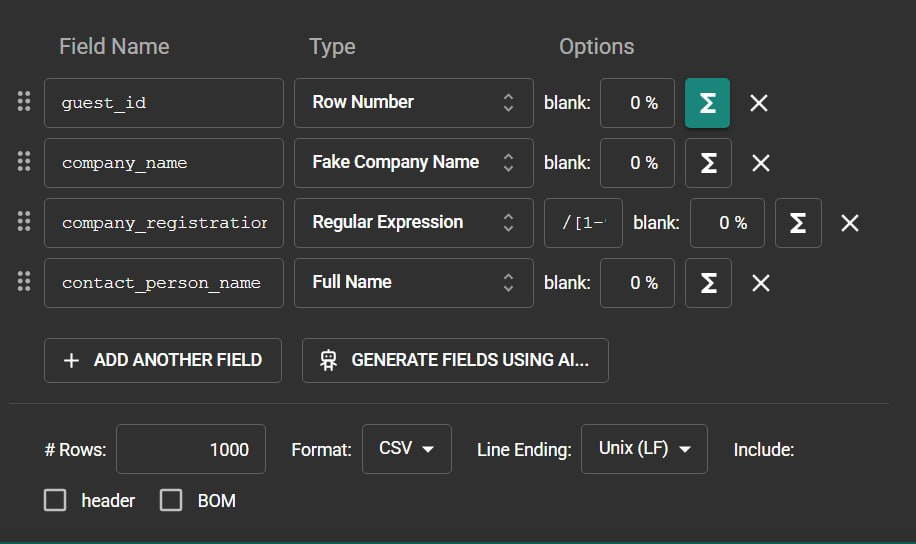
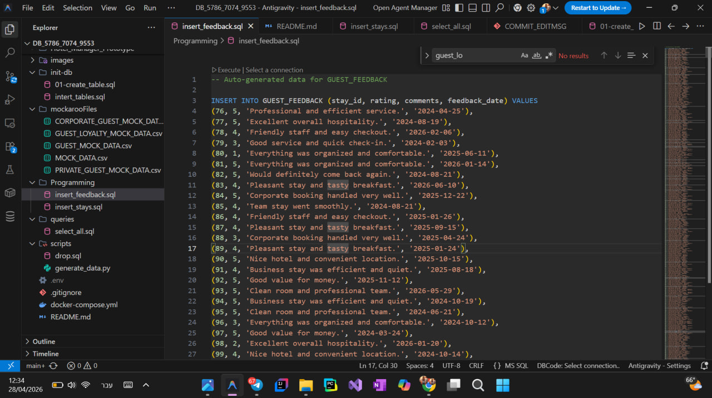
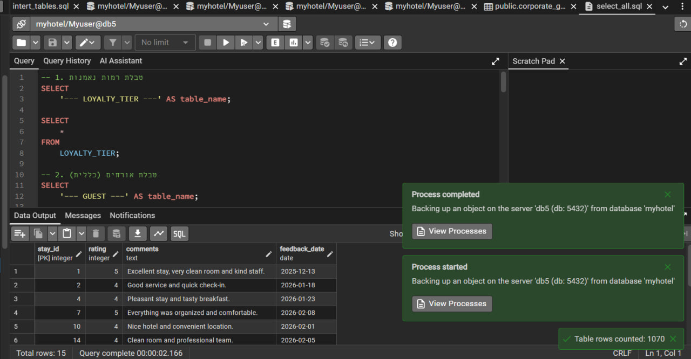

# DB_5786_7074_9553# DB Project – Stage A

## Authors
- [Yael Bashan]
- [Einat Mazuz]

## System Overview
This project presents the design and implementation of a database system using a Top-Down approach.

The system was first defined through user interface screens, and then translated into a database schema.
The database supports storing, managing, and querying structured data according to the system requirements.

## System Description
The system includes multiple entities and relationships, designed to reflect real-world data and operations.

Main features:
- Store structured data across multiple entities
- Maintain relationships between entities
- Support data insertion, querying, and validation
- Ensure data integrity using constraints

##  UI Design (Google AI Studio)

 Link to AI Studio project: [https://ai.studio/apps/10110a4d-540e-4e1b-b3de-6ddc788c73c2]

##  Database Design

### ERD Diagram

### DSD Diagram

### Design Decisions
- The database contains at least 6 entities (excluding ENUM tables)
- Relationships include 1:N and M:N using junction tables
- At least two DATE attributes were used
- Constraints were added to ensure valid data

##  Data Dictionary
Each table includes:
- Purpose
- Fields and data types
- Relationships

##  SQL Scripts
- createTables.sql – creates all tables
- dropTables.sql – drops all tables
- insertTables.sql – inserts data
- selectAll.sql – displays all data

##  Data Insertion Methods

### Method 1 – Manual Inserts

### Method 2 – CSV Import

### Method 3 – Generated Data

##  Backup

### Backup Creation

##  Project Structure

DBProject/
 └── StageA/
      ├── createTables.sql
      ├── dropTables.sql
      ├── insertTables.sql
      ├── selectAll.sql
      ├── ERD.png
      ├── DSD.png
      ├── backup.sql
      ├── images/
      ├── DataImportFiles/
      ├── Programing/
      └── mockarooFiles/

##  Summary
This stage focused on:
- System design (Top-Down)
- Database modeling (ERD + DSD)
- Data population (3 methods)
- Backup and restore validation

The result is a structured, normalized database ready for further development.
