# DB_5786_7074_9553  
# DB Project – Stage B

## Authors
- Yael Bashan
- Einat Mazuz

---

## Stage B Overview

In Stage B, we performed querying, updating, deleting, validation, transaction handling, and performance improvement on the hotel database created in Stage A.

The database represents a hotel guest management system, including private guests, corporate guests, stays, payments, guest feedback, and a loyalty program.

The main goal of this stage was to use SQL queries to extract meaningful information from the database, update and delete data in a controlled way, add new constraints, demonstrate transactions using `ROLLBACK` and `COMMIT`, and improve query performance using indexes.

---

## Submitted Files

- `Queries.sql` – contains all SELECT, UPDATE, and DELETE queries.
- `Constraints.sql` – contains new constraints added using `ALTER TABLE`.
- `RollbackCommit.sql` – contains transaction examples using `ROLLBACK` and `COMMIT`.
- `Index.sql` – contains index creation commands and performance tests.
- `backup2.sql` – updated database backup after Stage B.
- `README.md` – project report for Stage B.
- `images/` – screenshots of query execution, query results, updates, deletes, constraints, rollback/commit, and indexes.

---

# 1. SELECT Queries Implemented in Two Different Ways

This section includes four SELECT queries.  
Each query was implemented in two different ways in order to compare different SQL approaches and understand differences in readability and efficiency.

For each query, the report includes:
- Query description
- First implementation
- Execution screenshot
- Result screenshot
- Second implementation
- Execution screenshot
- Result screenshot
- Explanation of the difference between the two implementations

---

## Query 1 – Monthly Payments by Guests

### Query Description

This query displays the total amount paid by each guest during 2026, grouped by month.

The query combines data from the `Payment`, `Stay_Record`, `Guest`, `Private_Guest`, and `Corporate_Guest` tables.

This query is useful for a financial report screen in the hotel management system.

---

### First Implementation

```sql
SELECT
    EXTRACT(MONTH FROM p.payment_date) AS payment_month,
    CASE
        WHEN pg.guest_id IS NOT NULL THEN pg.first_name || ' ' || pg.last_name
        ELSE cg.company_name
    END AS guest_display_name,
    CASE
        WHEN pg.guest_id IS NOT NULL THEN 'Private'
        ELSE 'Corporate'
    END AS guest_type,
    SUM(p.amount) AS total_paid
FROM Payment p
JOIN Stay_Record sr ON p.stay_id = sr.stay_id
JOIN Guest g ON sr.guest_id = g.guest_id
LEFT JOIN Private_Guest pg ON g.guest_id = pg.guest_id
LEFT JOIN Corporate_Guest cg ON g.guest_id = cg.guest_id
WHERE EXTRACT(YEAR FROM p.payment_date) = 2026
GROUP BY
    payment_month,
    guest_display_name,
    guest_type
ORDER BY payment_month;
```

### Execution + Result Screenshot

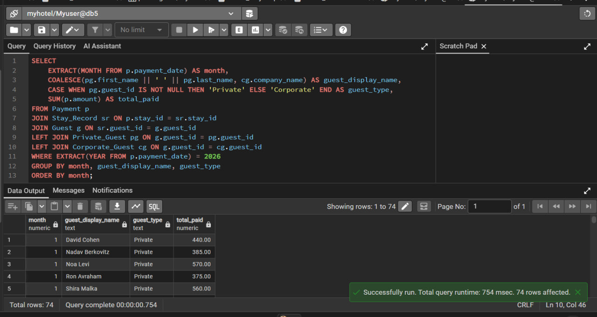

### Second Implementation

```sql
SELECT
    EXTRACT(MONTH FROM mp.payment_date) AS payment_month, 
    CASE -- CASE works like an IF condition.
        WHEN pg.guest_id IS NOT NULL THEN pg.first_name || ' ' || pg.last_name
        ELSE cg.company_name
    END AS guest_display_name,
    CASE
        WHEN pg.guest_id IS NOT NULL THEN 'Private'
        ELSE 'Corporate'
    END AS guest_type,
    SUM(mp.amount) AS total_paid 
FROM (
    SELECT
        payment_id,
        stay_id,
        amount,
        payment_date
    FROM Payment
    WHERE EXTRACT(YEAR FROM payment_date) = 2026
) AS mp
JOIN Stay_Record sr ON mp.stay_id = sr.stay_id
JOIN Guest g ON sr.guest_id = g.guest_id
LEFT JOIN Private_Guest pg ON g.guest_id = pg.guest_id
LEFT JOIN Corporate_Guest cg ON g.guest_id = cg.guest_id
GROUP BY
    payment_month,
    guest_display_name,
    guest_type
ORDER BY payment_month;

```

### Execution + Result Screenshot

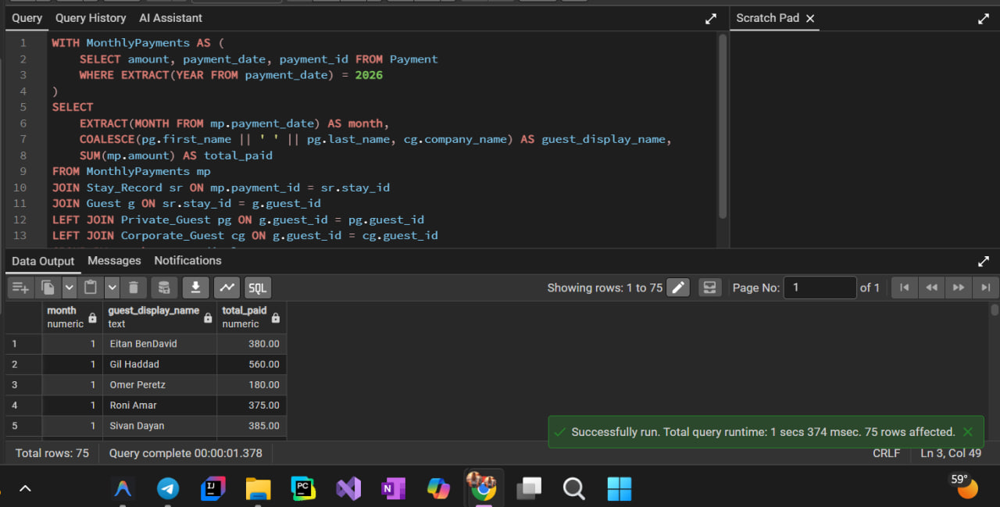

---

### Difference Between the Two Implementations

In the first implementation, the filtering of payments from 2026 is performed directly in the main query.

In the second implementation, the payments from 2026 are first filtered inside a subquery, and only then joined with the other tables.

The second implementation may be more efficient when the `Payment` table contains many rows, because it reduces the number of rows before performing the joins. However, PostgreSQL may optimize both versions similarly, so actual runtime should be checked.

---

## Query 2 – Guests With Many Stays and Low Ratings

### Query Description

This query finds guests who stayed at the hotel more than three times and have an average feedback rating lower than 3.

This query is useful for customer service, because it helps identify guests who may have had a poor experience and may require follow-up.

---

### First Implementation

```sql
SELECT 
    g.guest_id,
    CASE 
        WHEN pg.guest_id IS NOT NULL THEN pg.first_name || ' ' || pg.last_name
        ELSE cg.company_name
    END AS guest_name,
    COUNT(sr.stay_id) AS stay_count, 
    AVG(f.rating) AS avg_rating 
FROM Guest g
JOIN Stay_Record sr ON g.guest_id = sr.guest_id
JOIN Guest_Feedback f ON sr.stay_id = f.stay_id
LEFT JOIN Private_Guest pg ON g.guest_id = pg.guest_id
LEFT JOIN Corporate_Guest cg ON g.guest_id = cg.guest_id
GROUP BY
    g.guest_id,
    pg.guest_id,
    pg.first_name,
    pg.last_name,
    cg.company_name
HAVING COUNT(sr.stay_id) > 3 
   AND AVG(f.rating) < 3
ORDER BY avg_rating;
```

### Execution + Result Screenshot

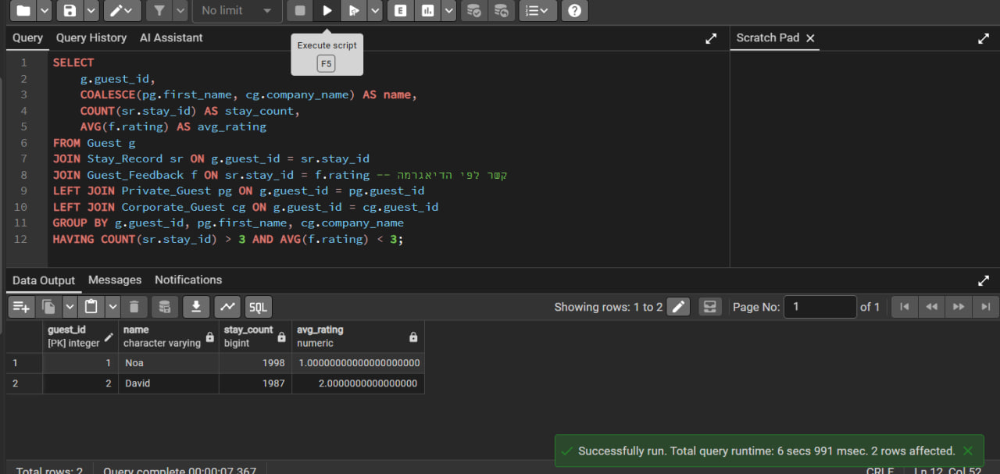

---

### Second Implementation

```sql
SELECT
    guest_stats.guest_id,
    guest_stats.guest_name,
    guest_stats.stay_count,
    guest_stats.avg_rating
FROM (
    SELECT 
        g.guest_id,
        CASE
            WHEN pg.guest_id IS NOT NULL THEN pg.first_name || ' ' || pg.last_name
            ELSE cg.company_name
        END AS guest_name,
        COUNT(sr.stay_id) AS stay_count,
        AVG(f.rating) AS avg_rating 
    FROM Guest g
    JOIN Stay_Record sr ON g.guest_id = sr.guest_id
    JOIN Guest_Feedback f ON sr.stay_id = f.stay_id
    LEFT JOIN Private_Guest pg ON g.guest_id = pg.guest_id
    LEFT JOIN Corporate_Guest cg ON g.guest_id = cg.guest_id
    GROUP BY
        g.guest_id,
        pg.guest_id,
        pg.first_name,
        pg.last_name,
        cg.company_name
) AS guest_stats 
WHERE guest_stats.stay_count > 3
  AND guest_stats.avg_rating < 3
ORDER BY guest_stats.avg_rating;

```

### Execution + Result Screenshot

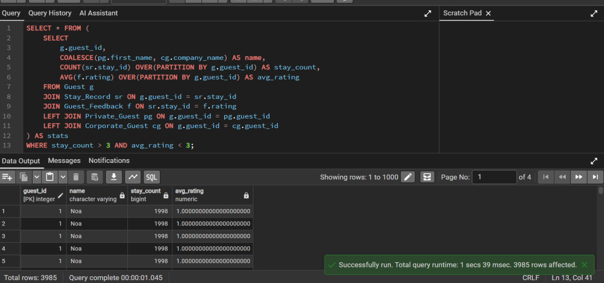

---

### Difference Between the Two Implementations

In the first implementation, the calculation and filtering are performed in the same query using `GROUP BY` and `HAVING`.

In the second implementation, the guest statistics are first calculated in a subquery, and then the outer query filters the result.

The first implementation is shorter.  
The second implementation may be easier to understand because it separates the calculation step from the filtering step.

---

## Query 3 – Top Guests by Loyalty Points

### Query Description

This query displays the guests with the highest loyalty points in each loyalty tier.

This query is useful for a loyalty management screen, where the hotel can identify the strongest customers in each tier.

---

### First Implementation

```sql
SELECT 
    lt.tier_name,
    CASE 
        WHEN pg.guest_id IS NOT NULL THEN pg.first_name || ' ' || pg.last_name
        ELSE cg.company_name
    END AS guest_name,
    gl.points_balance
FROM Loyalty_Tier lt
JOIN Guest_Loyalty gl ON lt.tier_id = gl.tier_id
JOIN Guest g ON gl.guest_id = g.guest_id
LEFT JOIN Private_Guest pg ON g.guest_id = pg.guest_id
LEFT JOIN Corporate_Guest cg ON g.guest_id = cg.guest_id
WHERE (
    SELECT COUNT(*) 
    FROM Guest_Loyalty gl2
    WHERE gl2.tier_id = gl.tier_id
      AND gl2.points_balance > gl.points_balance
) < 3
ORDER BY lt.tier_name, gl.points_balance DESC;


```

### Execution + Result Screenshot

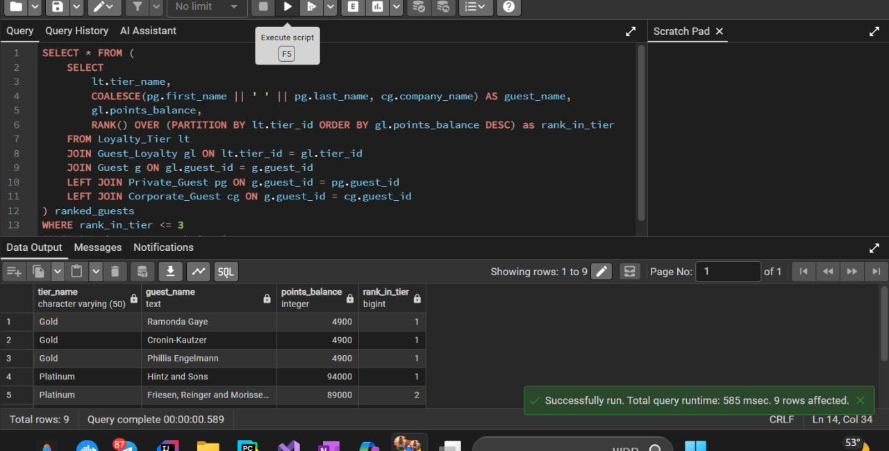

---

### Second Implementation

```sql
SELECT 
    lt.tier_name,
    COALESCE(pg.first_name  ' '  pg.last_name, cg.company_name) AS guest_name,
    gl.points_balance
FROM Loyalty_Tier lt
JOIN Guest_Loyalty gl ON lt.tier_id = gl.tier_id
JOIN Guest g ON gl.guest_id = g.guest_id
LEFT JOIN Private_Guest pg ON g.guest_id = pg.guest_id
LEFT JOIN Corporate_Guest cg ON g.guest_id = cg.guest_id
WHERE (
    SELECT COUNT(*) 
    FROM Guest_Loyalty gl2 
    WHERE gl2.tier_id = lt.tier_id AND gl2.points_balance >= gl.points_balance
) <= 3
ORDER BY lt.tier_name, gl.points_balance DESC;

```

### Execution + Result Screenshot

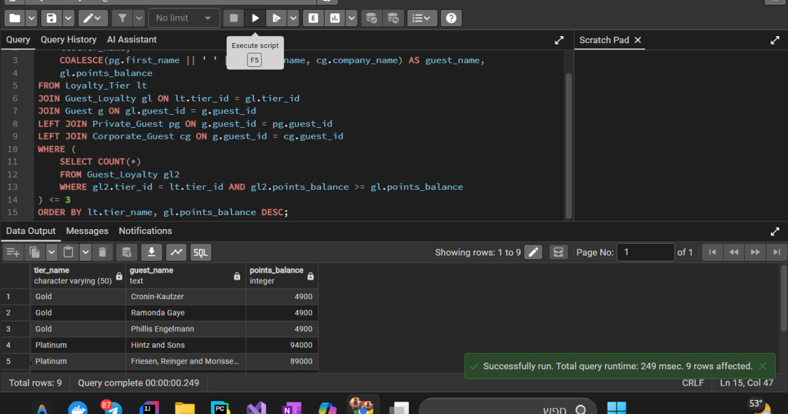

---

### Difference Between the Two Implementations

The second implementation uses COALESCE and a slightly different ranking condition using >= and <=.

The first implementation is stricter because it checks only guests with a higher points balance.

The second implementation may include additional guests when several guests have the same number of points.

---

## Query 4 – Guests in a Specific Date Range

### Query Description

This query displays guests who checked out during a specific date range.

This query is useful for a stay history screen or for hotel activity reports by period.

---

### First Implementation

```sql
SELECT 
    g.guest_id,
    CASE 
        WHEN pg.guest_id IS NOT NULL THEN pg.first_name || ' ' || pg.last_name
        ELSE cg.company_name
    END AS guest_name,
    sr.stay_id,
    EXTRACT(DAY FROM sr.check_out_date) AS checkout_day, 
    EXTRACT(MONTH FROM sr.check_out_date) AS checkout_month,
    EXTRACT(YEAR FROM sr.check_out_date) AS checkout_year
FROM Guest g
JOIN Stay_Record sr ON g.guest_id = sr.guest_id
LEFT JOIN Private_Guest pg ON g.guest_id = pg.guest_id
LEFT JOIN Corporate_Guest cg ON g.guest_id = cg.guest_id
WHERE sr.check_out_date BETWEEN '2024-10-01' AND '2024-12-31' -- BETWEEN checks if a value is inside a given range.
ORDER BY sr.check_out_date;
```

### Execution + Result Screenshot

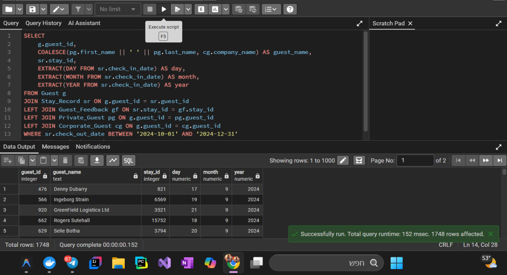

---

### Second Implementation

```sql
SELECT
    g.guest_id,
    CASE
        WHEN pg.guest_id IS NOT NULL THEN pg.first_name || ' ' || pg.last_name
        ELSE cg.company_name
    END AS guest_name,
    sr.stay_id,
    sr.check_out_date
FROM Guest g
JOIN Stay_Record sr ON g.guest_id = sr.guest_id
LEFT JOIN Private_Guest pg ON g.guest_id = pg.guest_id
LEFT JOIN Corporate_Guest cg ON g.guest_id = cg.guest_id
WHERE sr.check_out_date >= '2024-10-01'
  AND sr.check_out_date <= '2024-12-31'
ORDER BY sr.check_out_date;
```

### Execution + Result Screenshot

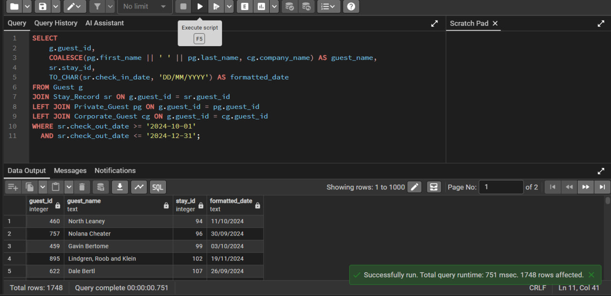

---

### Difference Between the Two Implementations

The first implementation uses `BETWEEN` to check whether the checkout date is inside the required range.

The second implementation uses two separate comparison conditions: `>=` and `<=`.

Both implementations return the same result.  
The `BETWEEN` version is shorter and more readable, while the comparison version explicitly shows the lower and upper limits of the date range.

---

# 2. Additional SELECT Queries

This section includes four additional SELECT queries.  
Each query joins several tables and returns useful information for the hotel management system.

---

## Query 5 – Guests Without Feedback

### Query Description

This query finds guests who completed a stay but did not leave feedback.

This query is useful for sending feedback request reminders to guests.

### SQL Code

```sql
SELECT
    g.guest_id,
    CASE
        WHEN pg.guest_id IS NOT NULL THEN pg.first_name || ' ' || pg.last_name
        ELSE cg.company_name
    END AS guest_name,
    sr.stay_id,
    sr.check_out_date,
    lt.tier_name
FROM Guest g
JOIN Stay_Record sr ON g.guest_id = sr.guest_id
JOIN Guest_Loyalty gl ON g.guest_id = gl.guest_id
JOIN Loyalty_Tier lt ON gl.tier_id = lt.tier_id
LEFT JOIN Private_Guest pg ON g.guest_id = pg.guest_id
LEFT JOIN Corporate_Guest cg ON g.guest_id = cg.guest_id
WHERE sr.stay_status = 'CheckedOut'
  AND NOT EXISTS (
      SELECT *
      FROM Guest_Feedback gf
      WHERE gf.stay_id = sr.stay_id
  )
ORDER BY sr.check_out_date DESC;
```

### Execution + Result Screenshot

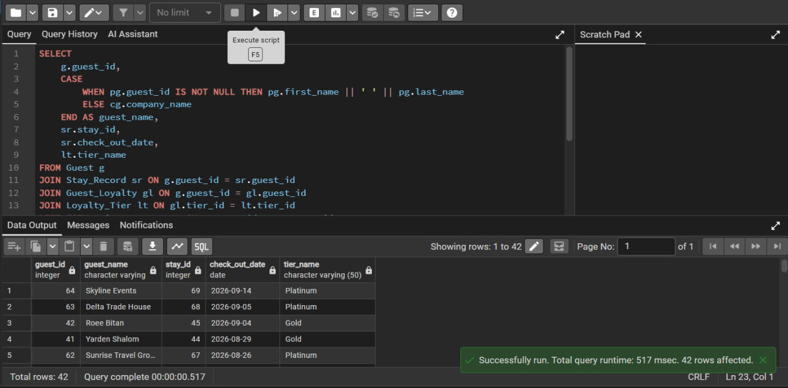

---

## Query 6 – Guests With Many Cancelled Stays

### Query Description

This query finds guests with several cancelled stays and displays their guest type and loyalty information.

This query is useful for a customer service monitoring screen.

### SQL Code

```sql
SELECT
    g.guest_id,
    CASE -- CASE works like an IF condition
        WHEN pg.guest_id IS NOT NULL THEN pg.first_name || ' ' || pg.last_name
        ELSE cg.company_name
    END AS guest_name,
    CASE
        WHEN pg.guest_id IS NOT NULL THEN 'Private'
        ELSE 'Corporate'
    END AS guest_type,
    COUNT(sr.stay_id) AS cancelled_stays,
    gl.status AS loyalty_status,
    lt.tier_name AS loyalty_tier
FROM Guest g 
JOIN Stay_Record sr ON g.guest_id = sr.guest_id 
JOIN Guest_Loyalty gl ON g.guest_id = gl.guest_id
JOIN Loyalty_Tier lt ON gl.tier_id = lt.tier_id
LEFT JOIN Private_Guest pg ON g.guest_id = pg.guest_id 
LEFT JOIN Corporate_Guest cg ON g.guest_id = cg.guest_id 
WHERE sr.stay_status = 'Cancelled'
GROUP BY
    g.guest_id,
    pg.guest_id,
    pg.first_name,
    pg.last_name,
    cg.company_name,
    gl.status,
    lt.tier_name
HAVING COUNT(sr.stay_id) >= 2
ORDER BY cancelled_stays DESC;

```

### Execution + Result Screenshot

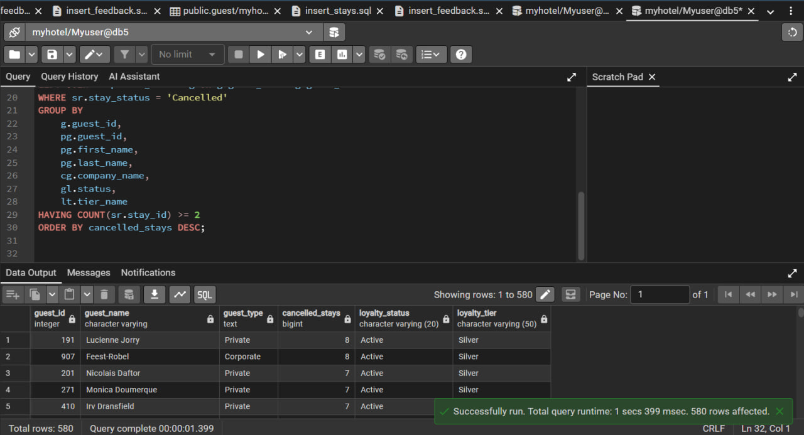

---

## Query 7 – Average Monthly Hotel Activity

### Query Description

This query calculates the average number of stays per month for each year.

This query is useful for a management dashboard that analyzes yearly hotel activity and workload.

### SQL Code

```sql
SELECT
    monthly_data.stay_year,
    AVG(monthly_data.stays_count) AS average_stays_per_month
FROM (
    SELECT
        EXTRACT(YEAR FROM sr.check_in_date) AS stay_year, -- EXTRACT gets a specific part.
        EXTRACT(MONTH FROM sr.check_in_date) AS stay_month,
        COUNT(sr.stay_id) AS stays_count
    FROM Stay_Record sr
    GROUP BY
        EXTRACT(YEAR FROM sr.check_in_date),
        EXTRACT(MONTH FROM sr.check_in_date)
) AS monthly_data
GROUP BY monthly_data.stay_year
ORDER BY monthly_data.stay_year;

```

### Execution + Result Screenshot

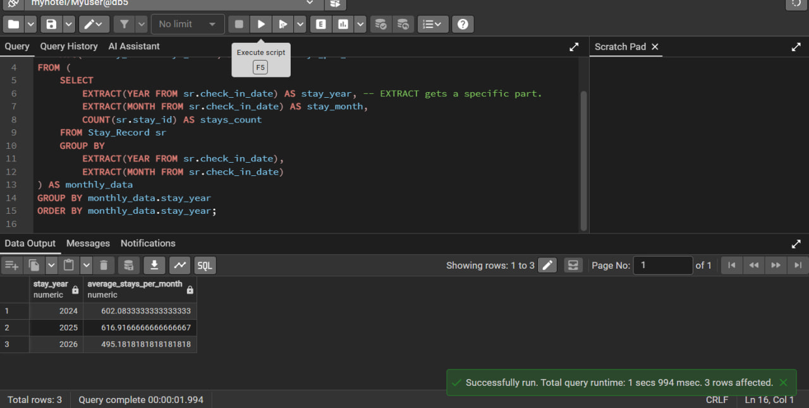

---

## Query 8 – Busiest Calendar Dates

### Query Description

This query displays the busiest calendar dates based on the average number of active stays across all years.

Unlike a query that checks only check-in dates, this query counts each stay for every date the guest was actually staying in the hotel.

This query is useful for workload planning and staff management.

### SQL Code

```sql
SELECT
    daily_data.month,
    daily_data.day,
    AVG(daily_data.active_stays_count) AS average_active_stays
FROM (
    SELECT
        EXTRACT(YEAR FROM active_day) AS year,
        EXTRACT(MONTH FROM active_day) AS month,
        EXTRACT(DAY FROM active_day) AS day,
        COUNT(*) AS active_stays_count
    FROM (
        SELECT
            generate_series( -- generate_series creates a list of values in a given range.
                check_in_date, --start date
                check_out_date - INTERVAL '1 day', -- end date,   INTERVAL represents a time duration.
                INTERVAL '1 day' -- Moves through the range in steps of one day
            )::date AS active_day -- Converts the generated value to DATE format
        FROM Stay_Record
        WHERE stay_status <> 'Cancelled'
    ) AS stay_days
    GROUP BY
        EXTRACT(YEAR FROM active_day),
        EXTRACT(MONTH FROM active_day),
        EXTRACT(DAY FROM active_day)
) AS daily_data
GROUP BY
    daily_data.month,
    daily_data.day
ORDER BY average_active_stays DESC;

```

### Execution + Result Screenshot

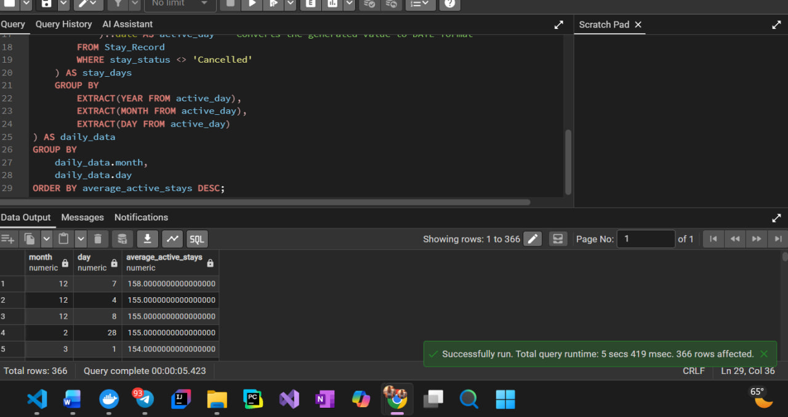

---

# 3. UPDATE Queries

This section includes three UPDATE queries.

For each UPDATE query, we show:
- The database state before the update
- The update command
- Execution screenshot
- The database state after the update

---

## Update Query 1 – Update Loyalty Tier

### Query Description

This query updates each guest's loyalty tier according to the number of loyalty points they currently have.

The update is based on the `points_required` values stored in the `Loyalty_Tier` table, instead of using hard-coded values.

### SQL Code

```sql
UPDATE Guest_Loyalty gl
SET tier_id = lt.tier_id
FROM Loyalty_Tier lt
WHERE gl.points_balance >= lt.points_required
  AND lt.points_required = (
      SELECT MAX(lt2.points_required)
      FROM Loyalty_Tier lt2
      WHERE gl.points_balance >= lt2.points_required
  );
```

### Execution + Result Screenshot

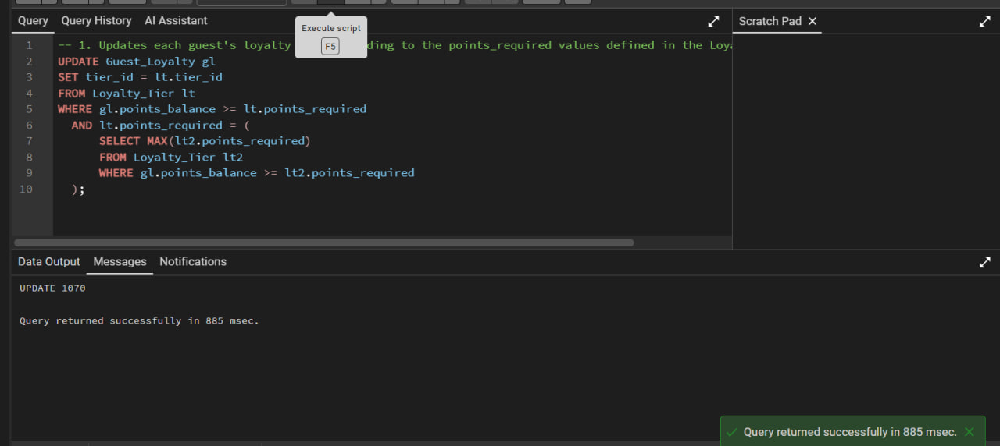

---

## Update Query 2 – Update Stay Status

### Query Description

This query updates stays whose checkout date has already passed and changes their status to `CheckedOut`.

This helps keep the stay records consistent with the actual stay dates.

### SQL Code

```sql
UPDATE Stay_Record
SET stay_status = 'CheckedOut'
WHERE check_out_date < CURRENT_DATE
  AND stay_status IN ('Booked', 'CheckedIn');
```

### Execution + Result Screenshot

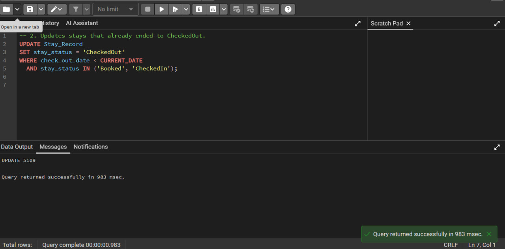

---

## Update Query 3 – Add Loyalty Points

### Query Description

This query adds loyalty points to guests according to completed payments.

This connects the payment process with the hotel loyalty program.

### SQL Code

```sql
UPDATE Guest_Loyalty gl
SET points_balance = points_balance + 100
WHERE guest_id IN (
    SELECT sr.guest_id
    FROM Stay_Record sr
    JOIN Payment p ON sr.stay_id = p.stay_id
    WHERE p.payment_status = 'Completed'
    GROUP BY sr.guest_id
    HAVING SUM(p.amount) >= 1000
);
```

### Execution + Result Screenshot

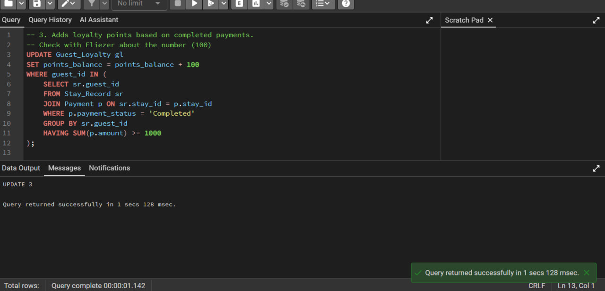

---

# 4. DELETE Queries

This section includes three DELETE queries.

For each DELETE query, we show:
- The database state before the deletion
- The delete command
- Execution screenshot
- The database state after the deletion

---

## Delete Query 1 – Delete Pending Payments for Cancelled Stays

### Query Description

This query deletes pending payments that belong to cancelled stays.


### SQL Code

```sql
DELETE FROM Payment p
WHERE p.payment_status = 'Failed'
  AND p.stay_id IN (
      SELECT sr.stay_id
      FROM Stay_Record sr
      WHERE sr.check_out_date < '2025-01-01'
  );
```

### Execution + Result Screenshot

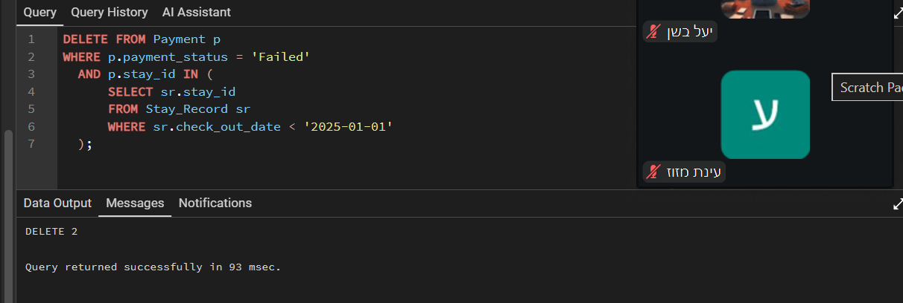

---

## Delete Query 2 – Delete Cancelled Future Stays Without Completed Payment

### Query Description

This query deletes future stays that were cancelled and do not have a completed payment.

This helps clean irrelevant future reservations from the system.


### SQL Code

```sql
DELETE FROM Stay_Record sr
WHERE sr.stay_status = 'Cancelled'
  AND sr.check_in_date > CURRENT_DATE
  AND NOT EXISTS (
      SELECT *
      FROM Payment p
      WHERE p.stay_id = sr.stay_id
        AND p.payment_status = 'Completed'
  );
```

### Execution + Result Screenshot

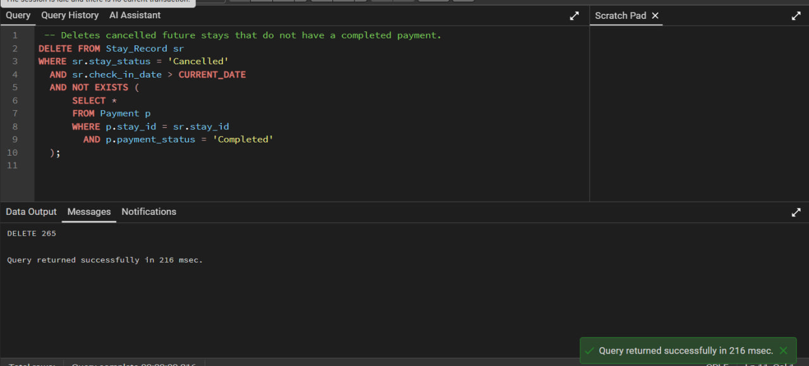

---

## Delete Query 3 – Delete Low Ratings When Better Recent Feedback Exists

### Query Description

This query removes low ratings when better recent feedback exists.

### SQL Code

```sql
DELETE FROM Guest_Feedback gf
WHERE gf.rating <= 2
  AND EXISTS (
      SELECT *
      FROM Stay_Record sr_old,
           Stay_Record sr_new,
           Guest_Feedback gf_new
      WHERE sr_old.stay_id = gf.stay_id
        AND sr_old.guest_id = sr_new.guest_id
        AND sr_new.stay_id = gf_new.stay_id
        AND sr_new.check_out_date > sr_old.check_out_date
        AND gf_new.rating >= 4
  );
```

### Execution + Result Screenshot

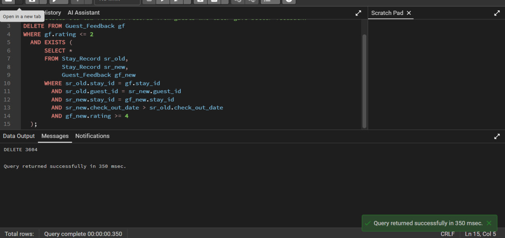

---

# 5. Constraints

This section includes three new constraints added using `ALTER TABLE`.

The purpose of the constraints is to improve data validity and prevent invalid values from being inserted or updated in the database.

For each constraint, we show:
- The purpose of the constraint
- The `ALTER TABLE` command
- An invalid data attempt
- The error received from PostgreSQL

---

## Constraint 1 – Membership Number Format

### Constraint Description

This constraint was added to the `Guest_Loyalty` table.

Its purpose is to make sure that membership numbers start with the prefix `MBR-`.

Example of a valid format:

```text
MBR-1234
```

### SQL Code

```sql
ALTER TABLE Guest_Loyalty
ADD CONSTRAINT chk_membership_number_format
CHECK (membership_number LIKE 'MBR-%');
```

### Invalid Data Test

```sql
INSERT INTO Guest_Loyalty
(guest_id, membership_number, points_balance, status, tier_id)
VALUES
(1, 'ABC-1234', 100, 'Active', 1);
```

### Error Screenshot

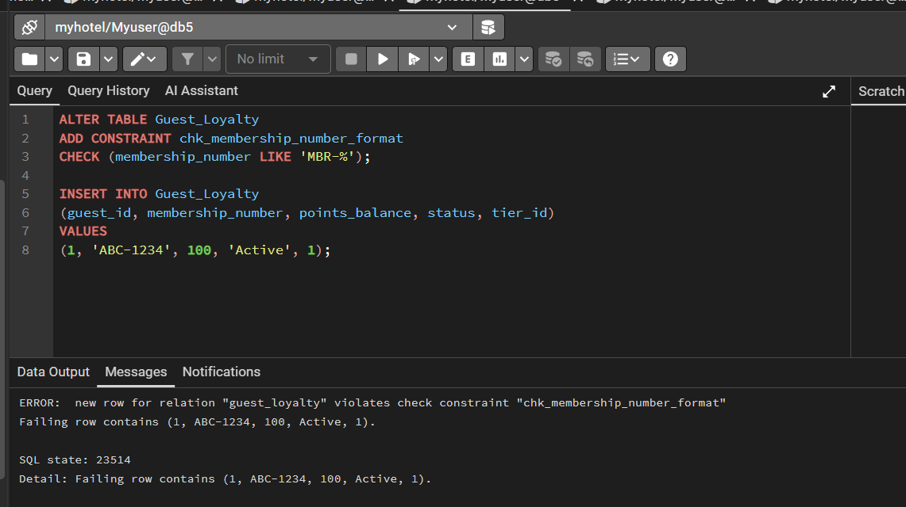

---

## Constraint 2 – Email Format

### Constraint Description

This constraint was added to the `Guest` table.

Its purpose is to make sure that guest email addresses contain the `@` character.

This helps prevent invalid email values from being stored in the database.

### SQL Code

```sql
ALTER TABLE Guest
ADD CONSTRAINT chk_guest_email_format
CHECK (email LIKE '%@%');
```

### Invalid Data Test

```sql
INSERT INTO Guest
(guest_id, phone, email, created_at)
VALUES
(999, '050-9999999', 'invalidemail.com', NOW());
```

### Error Screenshot

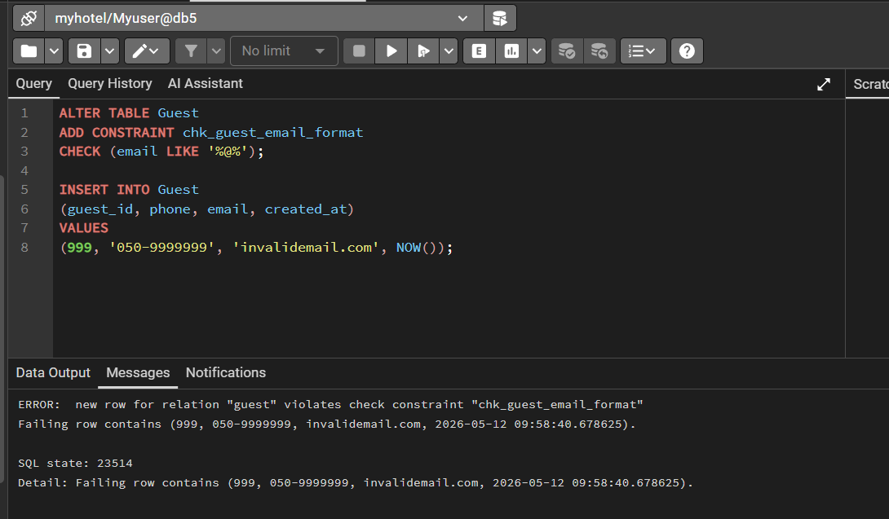

---

## Constraint 3 – Checkout Date After Check-in Date

### Constraint Description

This constraint was added to the `Stay_Record` table.

Its purpose is to make sure that the checkout date is after the check-in date.

This prevents stays with zero nights.

### SQL Code

```sql
ALTER TABLE Stay_Record
ADD CONSTRAINT chk_checkout_after_checkin
CHECK (check_out_date > check_in_date);
```

### Invalid Data Test

```sql
INSERT INTO Stay_Record
(stay_id, check_in_date, check_out_date, stay_status, guest_id)
VALUES
(999, '2026-05-10', '2026-05-10', 'CheckedOut', 1);
```

### Error Screenshot

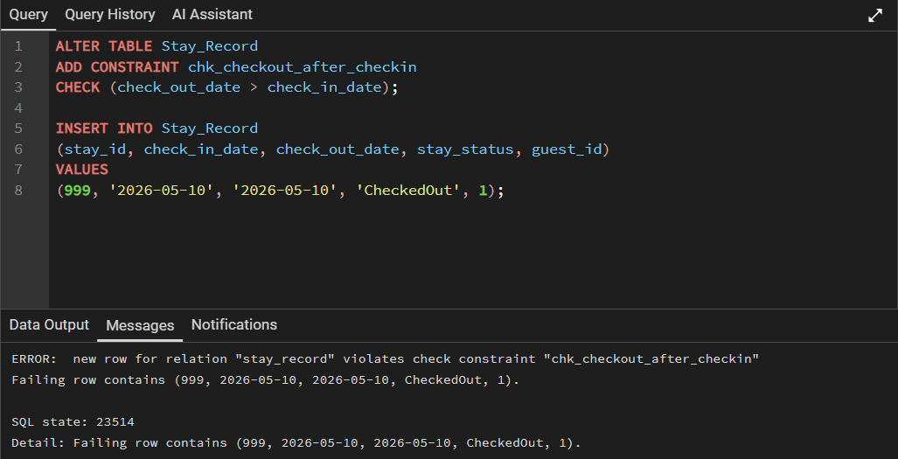

---

# 6. Rollback and Commit

This section demonstrates the use of transactions in PostgreSQL.

A transaction allows several database operations to be handled as one unit.

- `ROLLBACK` cancels all changes made since `BEGIN`.
- `COMMIT` saves all changes made since `BEGIN`.

---

## Rollback Example

### Description

In this example, we update a guest's loyalty status inside a transaction.

After the update, we use `ROLLBACK`, and the database returns to its original state.

### Database State Before Update

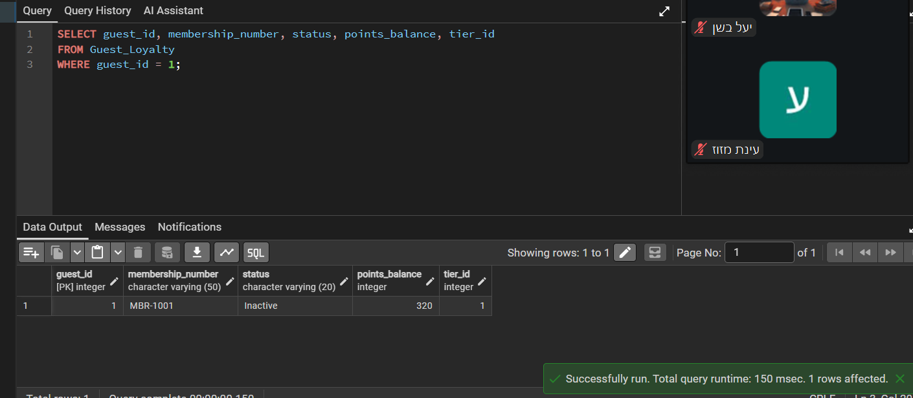

### SQL Code

```sql
BEGIN;

SELECT
    guest_id,
    membership_number,
    status,
    points_balance,
    tier_id
FROM Guest_Loyalty
WHERE guest_id = 1;

UPDATE Guest_Loyalty
SET status = 'Suspended'
WHERE guest_id = 1;

SELECT
    guest_id,
    membership_number,
    status,
    points_balance,
    tier_id
FROM Guest_Loyalty
WHERE guest_id = 1;

ROLLBACK;

SELECT
    guest_id,
    membership_number,
    status,
    points_balance,
    tier_id
FROM Guest_Loyalty
WHERE guest_id = 1;
```

### Database State After Update

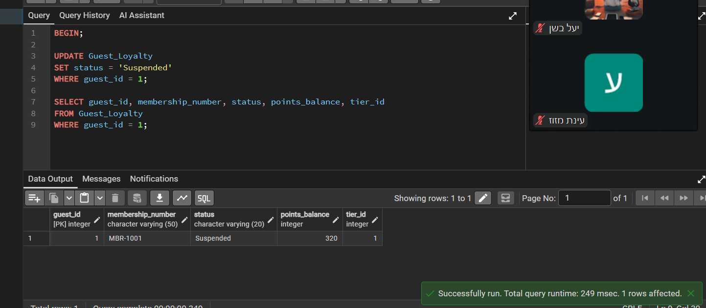

### Database State After ROLLBACK

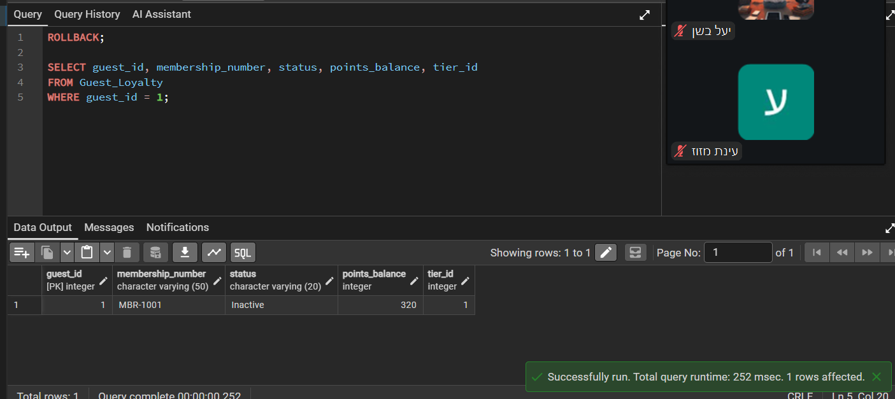

---

## Commit Example

### Description

In this example, we update a guest's loyalty status inside a transaction.

After the update, we use `COMMIT`, and the updated value remains in the database.

### Database State Before Update

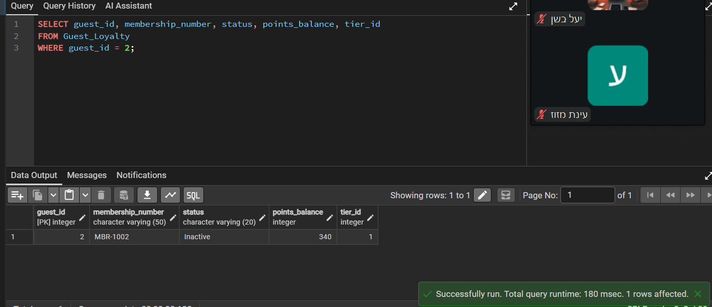

### SQL Code

```sql
BEGIN;

SELECT
    guest_id,
    membership_number,
    status,
    points_balance,
    tier_id
FROM Guest_Loyalty
WHERE guest_id = 2;

UPDATE Guest_Loyalty
SET status = 'Active'
WHERE guest_id = 2;

SELECT
    guest_id,
    membership_number,
    status,
    points_balance,
    tier_id
FROM Guest_Loyalty
WHERE guest_id = 2;

COMMIT;

SELECT
    guest_id,
    membership_number,
    status,
    points_balance,
    tier_id
FROM Guest_Loyalty
WHERE guest_id = 2;
```

### Database State After Update

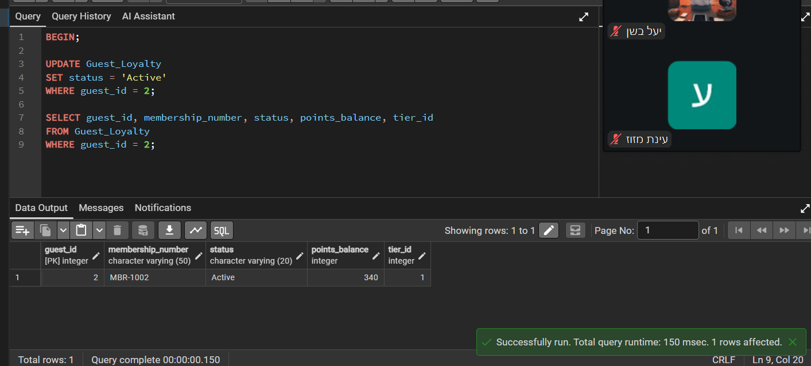

### Database State After COMMIT

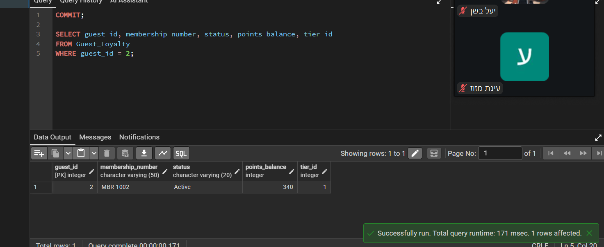

---

# 7. Indexes and Performance Analysis

This section includes three indexes.

Indexes help PostgreSQL find rows faster without scanning the entire table.

For each index, we tested the query runtime before and after creating the index using `EXPLAIN ANALYZE`.

---

## Index 1 – Stay_Record Guest Index

### Index Description

This index was added to the `guest_id` column in the `Stay_Record` table.

This column is frequently used when joining guests with their stays, so indexing it can improve query performance.

### Runtime Test Before Index

```sql
EXPLAIN ANALYZE
SELECT *
FROM Stay_Record
WHERE guest_id = 100;
```

### Runtime Screenshot Before Index

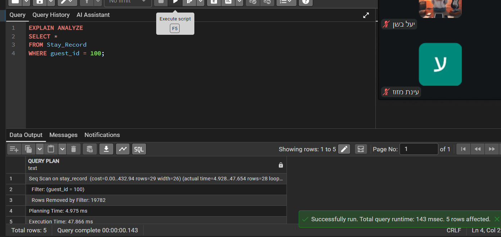

### SQL Code

```sql
CREATE INDEX idx_stay_record_guest_id
ON Stay_Record(guest_id);
```

### Runtime Test After Index

```sql
EXPLAIN ANALYZE
SELECT *
FROM Stay_Record
WHERE guest_id = 100;
```

### Runtime Screenshot After Index

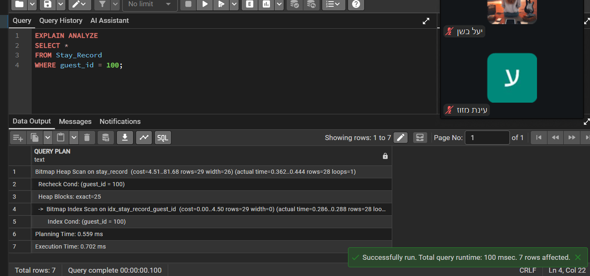

### Performance Explanation

Before creating the index, PostgreSQL may need to scan the entire `Stay_Record` table.

After creating the index, PostgreSQL can find the relevant rows more efficiently by using the index.

This can improve performance especially when the table contains many rows.

---

## Index 2 – Payment Stay Index

### Index Description

This index was added to the `stay_id` column in the `Payment` table.

This column connects payments to stay records, so indexing it can improve joins between `Payment` and `Stay_Record`.


### Runtime Test Before Index

```sql
EXPLAIN ANALYZE
SELECT *
FROM Payment
WHERE stay_id = 500;
```

### Runtime Screenshot Before Index

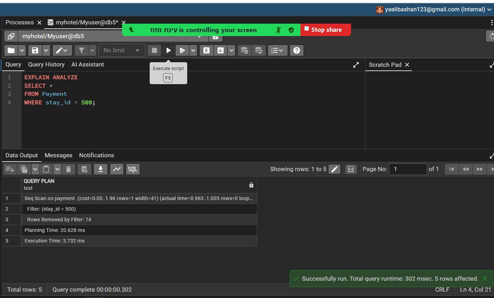

### SQL Code

```sql
CREATE INDEX idx_payment_stay_id
ON Payment(stay_id);
```

### Runtime Test After Index

```sql
EXPLAIN ANALYZE
SELECT *
FROM Payment
WHERE stay_id = 500;
```

### Runtime Screenshot After Index

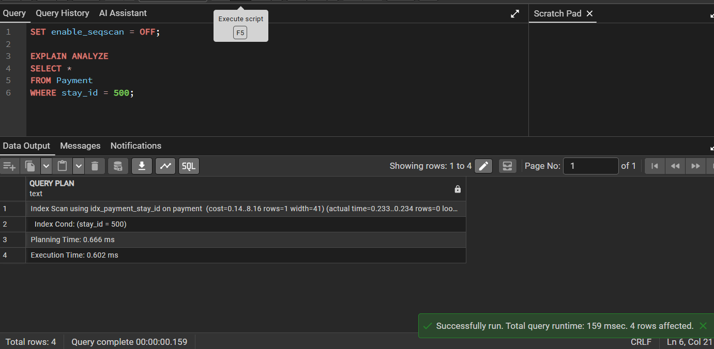

### Performance Explanation

Because the Payment table is relatively small, PostgreSQL may still choose a sequential scan. To demonstrate the index usage, sequential scan was temporarily disabled using SET enable_seqscan = OFF.
---

## Index 3 – Stay_Record Check-in Date Index

### Index Description

This index was added to the `check_in_date` column in the `Stay_Record` table.

This column is used in date-based queries that analyze hotel activity by date, month, or year.

### Runtime Test Before Index

```sql
EXPLAIN ANALYZE
SELECT *
FROM Stay_Record
WHERE check_in_date >= '2026-01-01';
```

### Runtime Screenshot Before Index

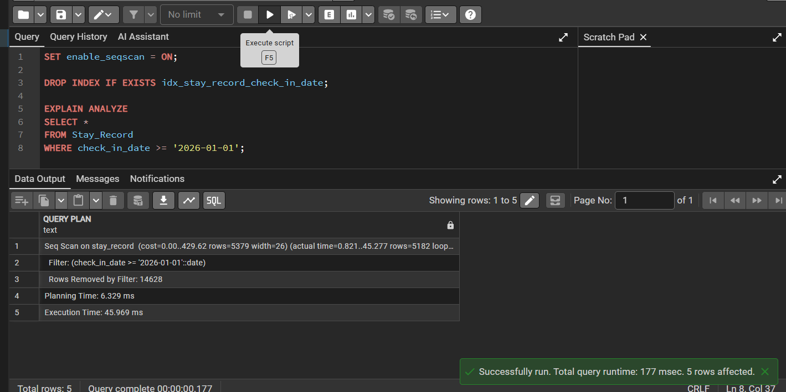

### SQL Code

```sql
CREATE INDEX idx_stay_record_check_in_date
ON Stay_Record(check_in_date);
```

### Runtime Test After Index

```sql
EXPLAIN ANALYZE
SELECT *
FROM Stay_Record
WHERE check_in_date >= '2026-01-01';
```

### Runtime Screenshot After Index

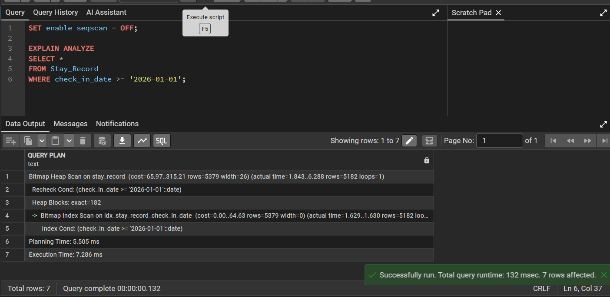

### Performance Explanation

Before creating the index, PostgreSQL may perform a full table scan.

After creating the index, PostgreSQL can filter rows by date more efficiently.

This is useful for queries that analyze hotel activity by date ranges.

---

# 8. Backup

After completing Stage B, an updated database backup was created.

Backup file:

```text
backup2.sql
```

The backup contains the current state of the database after adding the constraints and indexes and completing the Stage B database work.

---

# 9. Summary

Stage B focused on advanced SQL usage for analyzing, updating, validating, and optimizing the hotel database.

In this stage, we implemented:

- Complex SELECT queries
- Alternative implementations for query comparison
- UPDATE queries
- DELETE queries
- New constraints using `ALTER TABLE`
- Transaction handling using `ROLLBACK` and `COMMIT`
- Indexes and performance analysis
- Updated database backup

The database is now more reliable, better validated, and better prepared for efficient querying in the next stages of the project.
