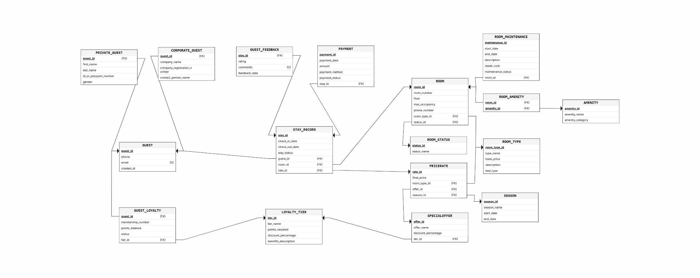
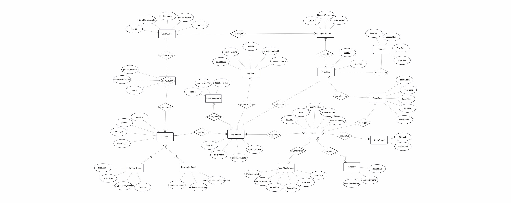
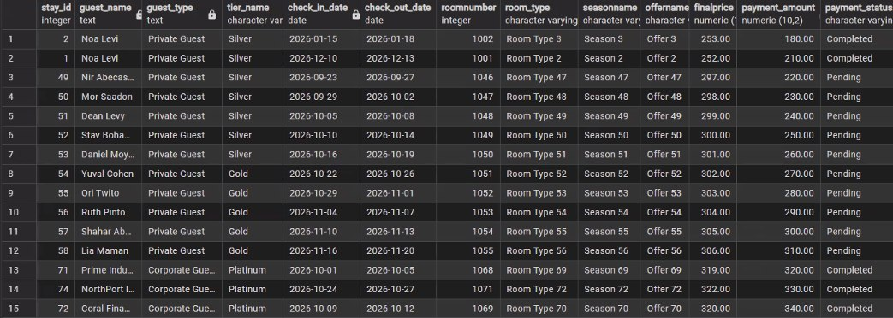
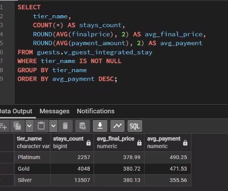
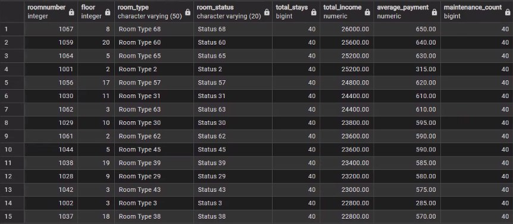
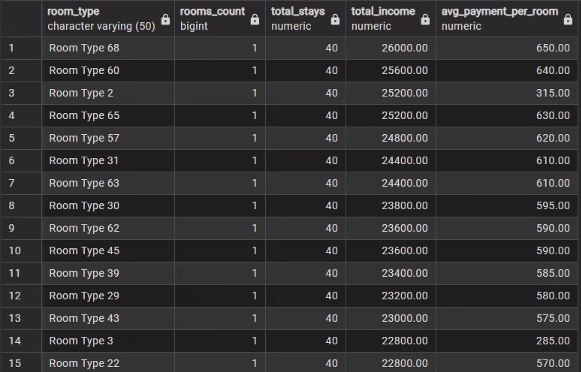

# DB Project -- Stage C

## Integration and Views

### Authors

-   Yael Bashan
-   Einat Mazuz

# Stage C Overview

In Stage C, we integrated our original hotel guest management database
with a room management database received from another department.

The original system manages guests, stay records, payments, guest
feedback, and loyalty tiers, while the received system manages rooms,
room types, room statuses, amenities, maintenance records, seasons,
special offers, and price rates.

The integration was performed by modifying the existing schemas using
`ALTER TABLE` commands rather than rebuilding the database.

Two integrated views were created:

-   `guests.v_guest_integrated_stay`
-   `rooms.v_room_management_dashboard`

# Submitted Files

-   NewDepartment_DSD.png
-   NewDepartment_ERD.png
-   Integrate.sql
-   Views.sql
-   backup3
-   README.md
-   images/

# Received Department

The received department represents a hotel room management system
containing:

-   Room
-   Room_Type
-   Room_Status
-   Amenity
-   Room_Amenity
-   Room_Maintenance
-   Season
-   SpecialOffer
-   PriceRate

# Reverse Engineering

The received backup was restored into PostgreSQL and reverse engineered
into ERD and DSD diagrams by identifying entities, attributes, primary
keys, foreign keys and relationships.

# Integration Design

The integration connects guest stays with room information and pricing.

Main integration points:

-   Stay_Record → Room
-   Stay_Record → PriceRate
-   SpecialOffer → Loyalty_Tier

# Integration Decisions

## Stay_Record → Room

Each stay references the room where the guest stayed.

## Stay_Record → PriceRate

Each stay references the pricing rule that determined its final price.

## SpecialOffer → Loyalty_Tier

Special offers may be assigned to specific loyalty tiers.

## Existing Tables

The existing database was preserved and modified using ALTER TABLE
statements.

# Main SQL Changes

-   Added `roomid` to `guests.stay_record`
-   Added `rateid` to `guests.stay_record`
-   Added `tier_id` to `rooms.specialoffer`
-   Created foreign key constraints
-   Updated existing data
-   Preserved previous functionality

# Data Validation

Validation queries verified that:

-   Stay records reference valid rooms.
-   Stay records reference valid price rates.
-   Special offers reference valid loyalty tiers.

# Previous Queries

Queries from the previous stage were executed successfully after
integration without modification.

# Views

## guests.v_guest_integrated_stay

Provides a guest-oriented integrated view including:

-   Guest information
-   Guest type
-   Loyalty tier
-   Stay dates
-   Assigned room
-   Room type
-   Season
-   Special offer
-   Final price
-   Payment amount
-   Payment status

### Query 1 -- Integrated Stay Details

Displays integrated stay information including guest details, room
assignment and payment information.

### Query 2 -- Average Payment by Loyalty Tier

Groups stays by loyalty tier and calculates:

-   Number of stays
-   Average final price
-   Average payment amount

This helps analyze loyalty program performance.

## rooms.v_room_management_dashboard

Provides a management dashboard combining room information with stays,
payments and maintenance statistics.

### Query 1 -- Most Profitable Rooms

Displays:

-   Room number
-   Floor
-   Room type
-   Room status
-   Total stays
-   Total income
-   Average payment
-   Maintenance count

Sorted by total income.

### Query 2 -- Income by Room Type

Aggregates data by room type and displays:

-   Room type
-   Number of rooms
-   Total stays
-   Total income
-   Average payment per room

Useful for comparing profitability across room categories.

# Backup

The `backup3` file contains the integrated database including the new
relationships, updated data and created views.

# Summary

Stage C successfully integrates the guest management and room management
systems into one unified hotel database.

The integration connects guests, stays, rooms, room types, room
statuses, payments, price rates, seasons, special offers, loyalty tiers,
amenities and maintenance records.

The resulting database supports comprehensive reporting, operational
analysis and financial insights through two integrated analytical views.
