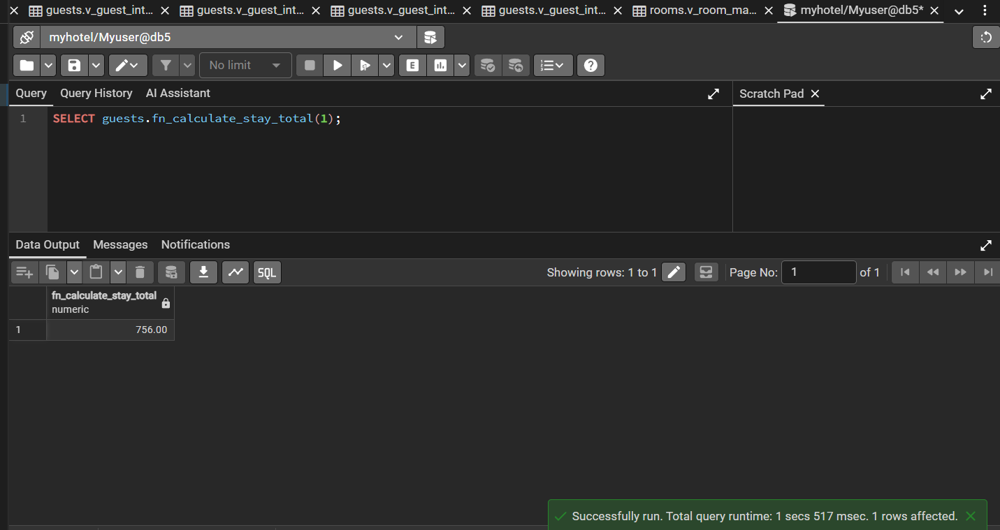
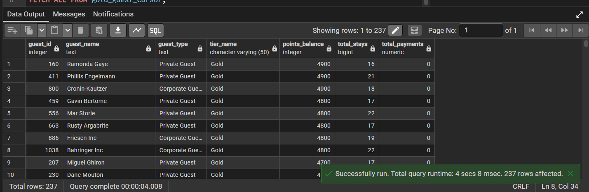
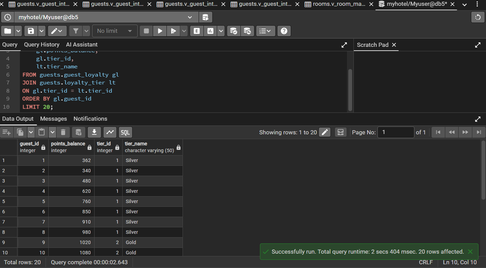
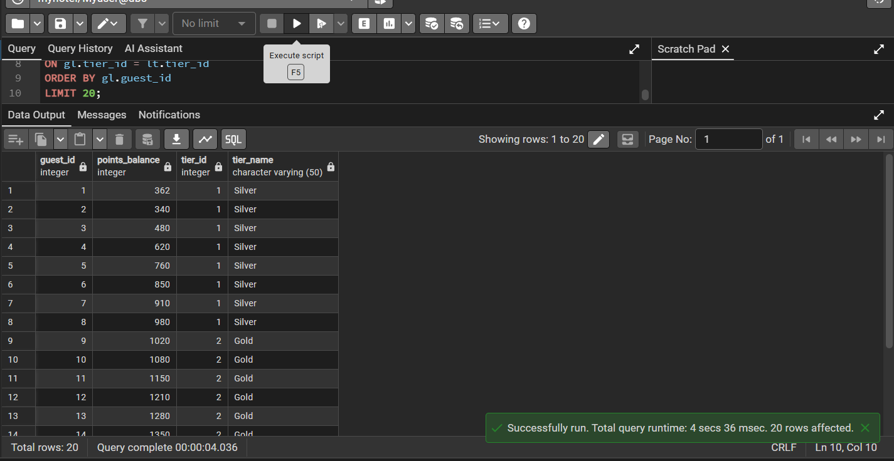
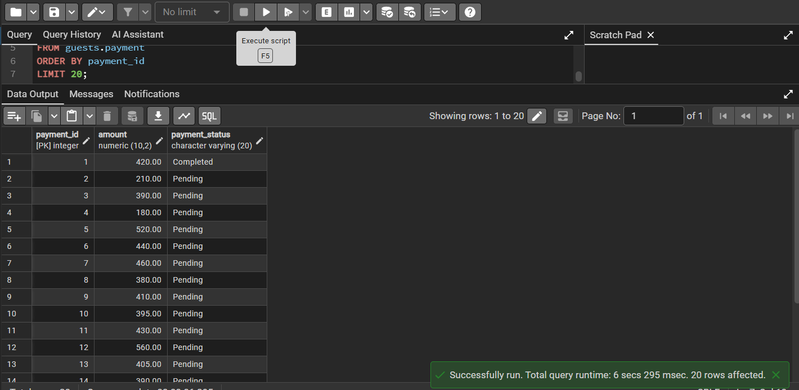
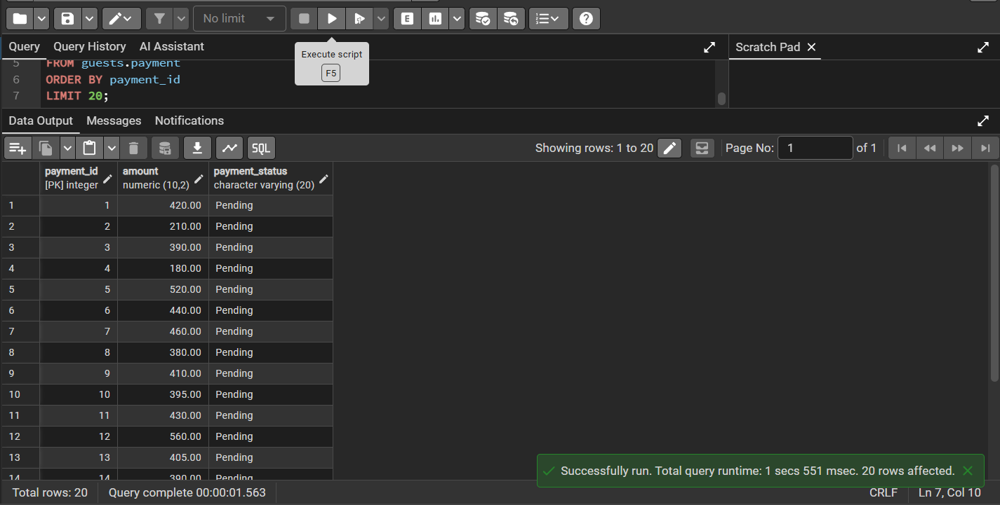
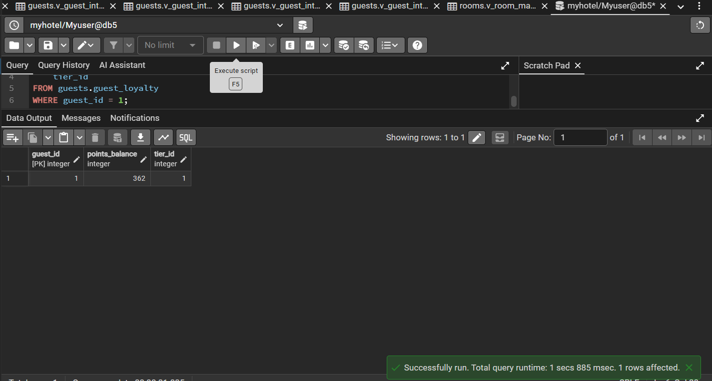
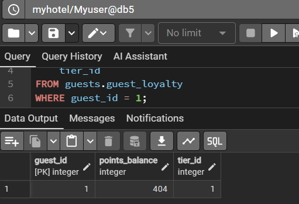
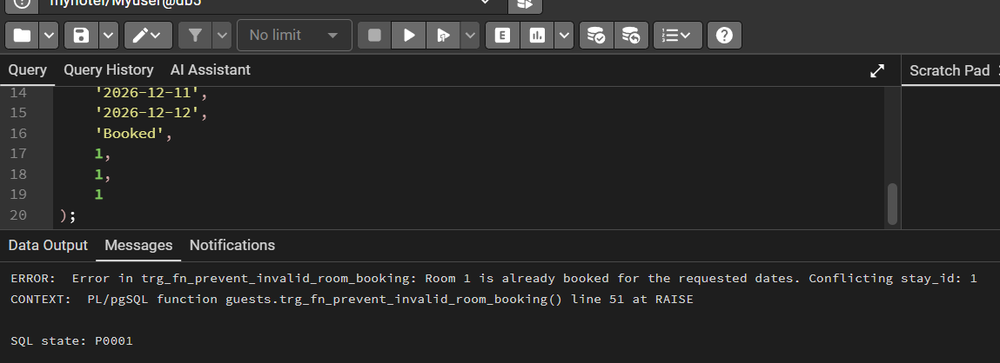
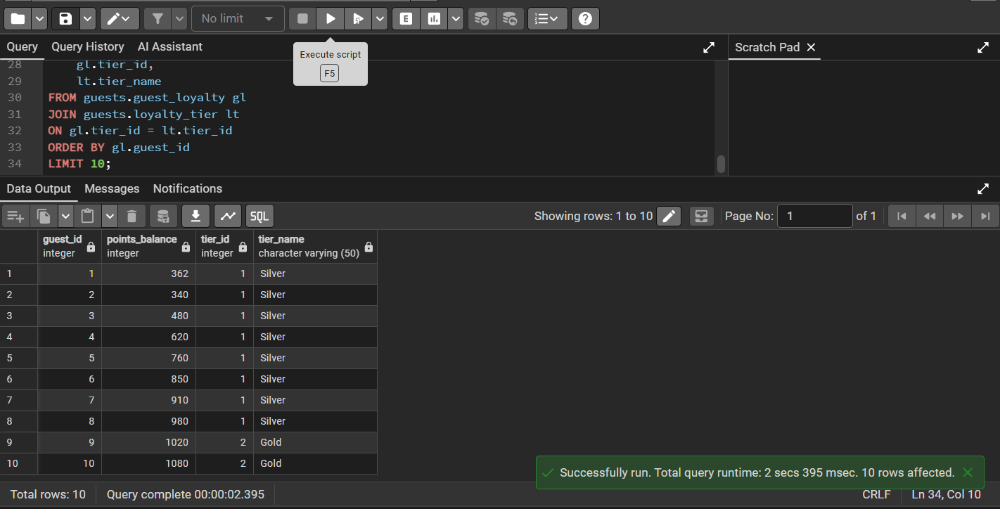

# DB Project – Stage D
# PL/pgSQL Programming

## Stage D Overview

In Stage D, we implemented PL/pgSQL programs on the integrated hotel database.
The programs use the expanded database created in Stage C, including the guest department and the room department.

The stage includes:
- 2 functions
- 2 procedures
- 2 triggers
- 2 main programs that call a function and a procedure

No structural table changes were required for this stage.

## Submitted SQL Files

- `01_Function_CalculateStayTotal.sql`
- `02_Function_GuestsByTierCursor.sql`
- `03_Procedure_UpdateLoyaltyTiers.sql`
- `04_Procedure_UpdatePaymentStatusesByPrice.sql`
- `05_Trigger_PaymentCompletedAddPoints.sql`
- `06_Trigger_PreventInvalidRoomBooking.sql`
- `07_Main_GuestProgram.sql`
- `08_Main_RoomProgram.sql`
- `09_Test_Triggers.sql` optional helper for screenshots
- `backup4`

## Program Summary

### Function 1 – Calculate Stay Total

The function `guests.fn_calculate_stay_total` receives a stay id and calculates the total expected price of the stay.
It uses the integrated relationship between `guests.stay_record` and `rooms.pricerate`.

Programming elements used:
- Variables
- Record variable
- `SELECT IN# DB_5786_7074_9553

# DB Project – Stage D

# PL/pgSQL Programming

## Authors

* Yael Bashan
* Einat Mazuz

---

## Stage D Overview

In Stage D, we implemented PL/pgSQL programs on the integrated hotel database created in Stage C.

The goal of this stage was to add business logic inside PostgreSQL using functions, procedures, and triggers.

Unlike previous stages, which focused mainly on SQL queries, schema design, constraints, indexes, views, and integration, this stage focuses on database programming.
The programs include variables, conditions, loops, cursors, exception handling, DML commands, records, and triggers.

The programs were written for the integrated hotel system, which combines the guest management department and the room management department.

The database includes guests, private guests, corporate guests, stays, payments, guest feedback, loyalty tiers, rooms, room types, room statuses, price rates, seasons, special offers, amenities, and room maintenance.

---

## Submitted Files

* `01_Function_CalculateStayTotal.sql` – creates a function that calculates the total price of a stay.
* `02_Function_GuestsByTierCursor.sql` – creates a function that returns a ref cursor with guests by loyalty tier.
* `03_Procedure_UpdateLoyaltyTiers.sql` – creates a procedure that updates guest loyalty tiers according to points.
* `04_Procedure_UpdatePaymentStatusesByPrice.sql` – creates a procedure that updates payment statuses according to expected stay price.
* `05_Trigger_PaymentCompletedAddPoints.sql` – creates a trigger that adds loyalty points when a payment becomes completed.
* `06_Trigger_PreventInvalidRoomBooking.sql` – creates a trigger that prevents invalid room bookings.
* `07_Main_GuestProgram.sql` – main program that runs one function and one procedure.
* `08_Main_RoomProgram.sql` – main program that runs one function and one procedure.
* `backup4` – updated database backup after Stage D.
* `README.md` – project report for Stage D.
* `images/` – screenshots proving that the programs were created and executed successfully.

No structural table changes were required in this stage.

---

# 1. Function – Calculate Stay Total

## File Name

```text
01_Function_CalculateStayTotal.sql
```

## Function Name

```sql
guests.fn_calculate_stay_total(p_stay_id INTEGER)
```

## Program Description

This function calculates the total price of a stay.

The function receives a `stay_id`, finds the relevant stay in `guests.stay_record`, connects it to `rooms.pricerate`, and calculates the total price according to the number of nights and the final price per night.

The calculation is:

```text
number of nights × final price
```

This function uses the integration created in Stage C:

```text
Stay_Record → PriceRate
```

This means that the guest department uses pricing data from the room department.

## PL/pgSQL Elements Used

* Function
* Variables
* `RECORD`
* `SELECT INTO`
* `IF`
* Date calculation
* `RAISE EXCEPTION`
* `RETURN`
* Exception handling

## SQL Code

```sql

CREATE OR REPLACE FUNCTION guests.fn_calculate_stay_total(p_stay_id INTEGER)
RETURNS NUMERIC(12,2)
LANGUAGE plpgsql
AS $$
DECLARE
    v_stay RECORD;
    v_nights INTEGER;
    v_total NUMERIC(12,2);
BEGIN
    SELECT
        sr.stay_id,
        sr.check_in_date,
        sr.check_out_date,
        sr.rateid,
        pr.finalprice
    INTO v_stay
    FROM guests.stay_record sr
    JOIN rooms.pricerate pr
        ON sr.rateid = pr.rateid
    WHERE sr.stay_id = p_stay_id;

    IF NOT FOUND THEN
        RAISE EXCEPTION 'Stay record with id % was not found, or it has no valid price rate.', p_stay_id;
    END IF;

    IF v_stay.check_out_date <= v_stay.check_in_date THEN
        RAISE EXCEPTION 'Invalid stay dates for stay_id %. Check-out date must be after check-in date.', p_stay_id;
    END IF;

    v_nights := v_stay.check_out_date - v_stay.check_in_date;
    v_total := v_nights * v_stay.finalprice;

    RETURN ROUND(v_total, 2);

EXCEPTION
    WHEN OTHERS THEN
        RAISE EXCEPTION 'Error in fn_calculate_stay_total for stay_id %: %', p_stay_id, SQLERRM;
END;
$$;

```

## Execution Example

```sql
SELECT guests.fn_calculate_stay_total(1);
```

## Execution Screenshot



## Explanation of Result

The function returned the calculated total price for the selected stay.
This proves that the function successfully used the stay dates and the integrated price rate data.

---

# 2. Function – Guests by Loyalty Tier Cursor

## File Name

```text
02_Function_GuestsByTierCursor.sql
```

## Function Name

```sql
guests.fn_get_guests_by_tier_cursor(p_tier_name TEXT, p_cursor_name TEXT)
```

## Program Description

This function returns a `REFCURSOR` containing guests from a selected loyalty tier.

The function receives a loyalty tier name, checks if the tier exists, and opens a cursor with guest details, guest type, loyalty tier, points balance, total stays, and total payments.

This function is useful for management reports about guests by loyalty tier.

## PL/pgSQL Elements Used

* Function
* `REFCURSOR`
* Boolean variable
* `EXISTS`
* `IF`
* `OPEN cursor FOR`
* Joins
* Aggregation using `COUNT` and `SUM`
* `GROUP BY`
* Exception handling

## SQL Code

```sql
CREATE OR REPLACE FUNCTION guests.fn_get_guests_by_tier_cursor(
    p_tier_name TEXT,
    p_cursor_name TEXT DEFAULT 'guest_tier_cursor'
)
RETURNS REFCURSOR
LANGUAGE plpgsql
AS $$
DECLARE
    v_cursor REFCURSOR := p_cursor_name;
    v_tier_exists BOOLEAN;
BEGIN
    SELECT EXISTS (
        SELECT 1
        FROM guests.loyalty_tier lt
        WHERE lt.tier_name = p_tier_name
    )
    INTO v_tier_exists;

    IF NOT v_tier_exists THEN
        RAISE EXCEPTION 'Loyalty tier "%" does not exist', p_tier_name;
    END IF;

    OPEN v_cursor FOR
        SELECT
            g.guest_id,

            COALESCE(
                pg.first_name || ' ' || pg.last_name,
                cg.company_name
            ) AS guest_name,

            CASE
                WHEN pg.guest_id IS NOT NULL THEN 'Private Guest'
                WHEN cg.guest_id IS NOT NULL THEN 'Corporate Guest'
                ELSE 'Unknown'
            END AS guest_type,

            lt.tier_name,
            gl.points_balance,
            COUNT(DISTINCT sr.stay_id) AS total_stays,
            COALESCE(SUM(p.amount), 0) AS total_payments

        FROM guests.guest g

        JOIN guests.guest_loyalty gl
            ON g.guest_id = gl.guest_id

        JOIN guests.loyalty_tier lt
            ON gl.tier_id = lt.tier_id

        LEFT JOIN guests.private_guest pg
            ON g.guest_id = pg.guest_id

        LEFT JOIN guests.corporate_guest cg
            ON g.guest_id = cg.guest_id

        LEFT JOIN guests.stay_record sr
            ON g.guest_id = sr.guest_id

        LEFT JOIN guests.payment p
            ON sr.stay_id = p.stay_id

        WHERE lt.tier_name = p_tier_name

        GROUP BY
            g.guest_id,
            pg.guest_id,
            pg.first_name,
            pg.last_name,
            cg.guest_id,
            cg.company_name,
            lt.tier_name,
            gl.points_balance

        ORDER BY gl.points_balance DESC;

    RETURN v_cursor;

EXCEPTION
    WHEN OTHERS THEN
        RAISE EXCEPTION 'Error in fn_get_guests_by_tier_cursor: %', SQLERRM;
END;
$$;
```

## Execution Example

```sql
BEGIN;

SELECT guests.fn_get_guests_by_tier_cursor('Gold', 'gold_guest_cursor');

FETCH ALL FROM gold_guest_cursor;

COMMIT;
```

## Execution Screenshot



## Explanation of Result

The function opened a cursor and returned guests that belong to the selected loyalty tier.
The result includes guest information, points, stay count, and total payments.

---

# 3. Procedure – Update Loyalty Tiers

## File Name

```text
03_Procedure_UpdateLoyaltyTiers.sql
```

## Procedure Name

```sql
guests.pr_update_loyalty_tiers()
```

## Program Description

This procedure updates the loyalty tier of each guest according to the number of points in `guests.guest_loyalty`.

For each guest, the procedure finds the highest loyalty tier whose `points_required` value is lower than or equal to the guest’s current points balance.

If the guest is assigned to the wrong tier, the procedure updates the `tier_id`.

## PL/pgSQL Elements Used

* Procedure
* Explicit cursor
* `OPEN`
* `FETCH`
* `LOOP`
* `EXIT WHEN NOT FOUND`
* `RECORD`
* `SELECT INTO`
* `IF` / `ELSIF`
* `UPDATE`
* `RAISE NOTICE`
* Exception handling

## SQL Code

```sql
CREATE OR REPLACE PROCEDURE guests.pr_update_loyalty_tiers()
LANGUAGE plpgsql
AS $$
DECLARE 
    loyalty_cursor CURSOR FOR
        SELECT guest_id, points_balance, tier_id
        FROM guests.guest_loyalty
        ORDER BY guest_id;

    v_loyalty RECORD;
    v_new_tier_id INTEGER;
    v_updated_count INTEGER := 0;
BEGIN
    OPEN loyalty_cursor;

    LOOP
        FETCH loyalty_cursor INTO v_loyalty;
        EXIT WHEN NOT FOUND;

        SELECT lt.tier_id
        INTO v_new_tier_id
        FROM guests.loyalty_tier lt
        WHERE v_loyalty.points_balance >= lt.points_required
        ORDER BY lt.points_required DESC
        LIMIT 1;

        IF v_new_tier_id IS NULL THEN
            RAISE NOTICE 'No matching tier found for guest_id % with % points.',
                v_loyalty.guest_id,
                v_loyalty.points_balance;
        ELSIF v_new_tier_id <> v_loyalty.tier_id THEN
            UPDATE guests.guest_loyalty
            SET tier_id = v_new_tier_id
            WHERE guest_id = v_loyalty.guest_id;

            v_updated_count := v_updated_count + 1;
        END IF;
    END LOOP;

    CLOSE loyalty_cursor;

    RAISE NOTICE 'Loyalty tier update completed. Updated rows: %', v_updated_count;

EXCEPTION
    WHEN OTHERS THEN
        IF loyalty_cursor%ISOPEN THEN
            CLOSE loyalty_cursor;
        END IF;
        RAISE EXCEPTION 'Error in pr_update_loyalty_tiers: %', SQLERRM;
END;
$$;

```

## Execution Example

```sql
CALL guests.pr_update_loyalty_tiers();
```

## Before Execution Screenshot



## After Execution Screenshot



## Explanation of Result

The procedure checked every guest loyalty record and updated the tier when needed.
The screenshots show the loyalty tier data before and after running the procedure.

---

# 4. Procedure – Update Payment Statuses by Price

## File Name

```text
04_Procedure_UpdatePaymentStatusesByPrice.sql
```

## Procedure Name

```sql
guests.pr_update_payment_statuses_by_price()
```

## Program Description

This procedure updates payment statuses according to the expected stay price.

The expected stay price is calculated using:

```text
number of nights × final price
```

The final price is taken from `rooms.pricerate`, using the integrated relationship:

```text
Payment → Stay_Record → PriceRate
```

The procedure updates each payment status according to the following logic:

* If `amount <= 0`, the status becomes `Failed`.
* If `amount >= expected_amount`, the status becomes `Completed`.
* Otherwise, the status becomes `Pending`.

## PL/pgSQL Elements Used

* Procedure
* Explicit cursor
* `RECORD`
* `LOOP`
* `IF` / `ELSIF` / `ELSE`
* Date calculation
* `UPDATE`
* `CONTINUE`
* `RAISE NOTICE`
* Exception handling
* Use of integrated tables from both departments

## SQL Code

```sql
-- Paste the content of 04_Procedure_UpdatePaymentStatusesByPrice.sql hereCREATE OR REPLACE PROCEDURE guests.pr_update_payment_statuses_by_price()
LANGUAGE plpgsql
AS $$
DECLARE
    payment_cursor CURSOR FOR
        SELECT
            p.payment_id,
            p.amount,
            p.payment_status,
            sr.stay_id,
            sr.check_in_date,
            sr.check_out_date,
            pr.finalprice
        FROM guests.payment p
        JOIN guests.stay_record sr
            ON p.stay_id = sr.stay_id
        JOIN rooms.pricerate pr
            ON sr.rateid = pr.rateid
        ORDER BY p.payment_id;

    v_payment RECORD;
    v_nights INTEGER;
    v_expected_amount NUMERIC(12,2);
    v_new_status TEXT;
    v_updated_count INTEGER := 0;
BEGIN
    OPEN payment_cursor;

    LOOP
        FETCH payment_cursor INTO v_payment;
        EXIT WHEN NOT FOUND;

        IF v_payment.check_out_date <= v_payment.check_in_date THEN
            RAISE NOTICE 'Skipping payment_id %, invalid dates for stay_id %.',
                v_payment.payment_id,
                v_payment.stay_id;
            CONTINUE;
        END IF;

        v_nights := v_payment.check_out_date - v_payment.check_in_date;
        v_expected_amount := ROUND(v_nights * v_payment.finalprice, 2);

        IF v_payment.amount <= 0 THEN
            v_new_status := 'Failed';
        ELSIF v_payment.amount >= v_expected_amount THEN
            v_new_status := 'Completed';
        ELSE
            v_new_status := 'Pending';
        END IF;

        IF v_new_status IS DISTINCT FROM v_payment.payment_status THEN
            UPDATE guests.payment
            SET payment_status = v_new_status
            WHERE payment_id = v_payment.payment_id;

            v_updated_count := v_updated_count + 1;
        END IF;
    END LOOP;

    CLOSE payment_cursor;

    RAISE NOTICE 'Payment status update completed. Updated rows: %', v_updated_count;

EXCEPTION
    WHEN OTHERS THEN
        IF payment_cursor%ISOPEN THEN
            CLOSE payment_cursor;
        END IF;
        RAISE EXCEPTION 'Error in pr_update_payment_statuses_by_price: %', SQLERRM;
END;
$$;
```

## Execution Example

```sql
CALL guests.pr_update_payment_statuses_by_price();
```

## Before Execution Screenshot



## After Execution Screenshot



## Explanation of Result

The procedure calculated the expected price for each stay and updated the payment status according to the actual amount paid.
This proves that the integrated pricing data is used in payment logic.

---

# 5. Trigger – Payment Completed Add Points

## File Name

```text
05_Trigger_PaymentCompletedAddPoints.sql
```

## Trigger Name

```sql
trg_payment_completed_add_points
```

## Trigger Table

```sql
guests.payment
```

## Trigger Timing

```text
AFTER UPDATE OF payment_status
```

## Program Description

This trigger adds loyalty points to a guest when a payment status is updated to `Completed`.

The trigger uses `OLD` and `NEW` values to make sure that points are added only when the payment status actually changes to `Completed`.

The trigger finds the guest through:

```text
Payment → Stay_Record → Guest
```

Then it calculates points according to the payment amount and the guest’s loyalty tier.

## PL/pgSQL Elements Used

* Trigger function
* `RETURNS TRIGGER`
* `OLD`
* `NEW`
* `IF`
* `SELECT INTO`
* `UPDATE`
* `RETURNING`
* `RAISE NOTICE`
* Exception handling
* `AFTER UPDATE`

## SQL Code

```sql
CREATE OR REPLACE FUNCTION guests.trg_fn_payment_completed_add_points()
RETURNS TRIGGER
LANGUAGE plpgsql
AS $$
DECLARE
    v_guest_id INTEGER;
    v_tier_id INTEGER;
    v_tier_discount NUMERIC(5,2);
    v_points_to_add INTEGER;
    v_new_points INTEGER;
    v_new_tier_id INTEGER;
BEGIN
    IF OLD.payment_status IS DISTINCT FROM NEW.payment_status
       AND NEW.payment_status = 'Completed'
       AND OLD.payment_status <> 'Completed' THEN

        SELECT sr.guest_id
        INTO v_guest_id
        FROM guests.stay_record sr
        WHERE sr.stay_id = NEW.stay_id;

        IF v_guest_id IS NULL THEN
            RAISE NOTICE 'No guest was found for stay_id %.', NEW.stay_id;
            RETURN NEW;
        END IF;

        SELECT gl.tier_id, COALESCE(lt.discount_percentage, 0)
        INTO v_tier_id, v_tier_discount
        FROM guests.guest_loyalty gl
        JOIN guests.loyalty_tier lt
            ON gl.tier_id = lt.tier_id
        WHERE gl.guest_id = v_guest_id;

        IF NOT FOUND THEN
            RAISE NOTICE 'Guest % does not have a loyalty record.', v_guest_id;
            RETURN NEW;
        END IF;

        -- Basic logic:
        -- 1 point for every 10 currency units,
        -- plus a bonus according to the loyalty tier discount percentage.
        v_points_to_add := FLOOR((NEW.amount / 10) * (1 + v_tier_discount / 100));

        IF v_points_to_add < 1 THEN
            v_points_to_add := 1;
        END IF;

        UPDATE guests.guest_loyalty
        SET points_balance = points_balance + v_points_to_add
        WHERE guest_id = v_guest_id
        RETURNING points_balance INTO v_new_points;

        -- After adding points, update the tier if the guest reached a higher tier.
        SELECT lt.tier_id
        INTO v_new_tier_id
        FROM guests.loyalty_tier lt
        WHERE v_new_points >= lt.points_required
        ORDER BY lt.points_required DESC
        LIMIT 1;

        IF v_new_tier_id IS NOT NULL THEN
            UPDATE guests.guest_loyalty
            SET tier_id = v_new_tier_id
            WHERE guest_id = v_guest_id;
        END IF;

        RAISE NOTICE 'Added % loyalty points to guest_id %.', v_points_to_add, v_guest_id;
    END IF;

    RETURN NEW;

EXCEPTION
    WHEN OTHERS THEN
        RAISE EXCEPTION 'Error in trg_fn_payment_completed_add_points: %', SQLERRM;
END;
$$;

DROP TRIGGER IF EXISTS trg_payment_completed_add_points ON guests.payment;

CREATE TRIGGER trg_payment_completed_add_points
AFTER UPDATE OF payment_status ON guests.payment
FOR EACH ROW
EXECUTE FUNCTION guests.trg_fn_payment_completed_add_points();

```

## Execution Example

```sql
UPDATE guests.payment
SET payment_status = 'Completed'
WHERE payment_id = 1;
```

## Before Execution Screenshot



## After Execution Screenshot



## Explanation of Result

After the payment status was changed to `Completed`, the trigger automatically added loyalty points to the guest.
This proves that the trigger runs automatically after an update on the `payment_status` column.

---

# 6. Trigger – Prevent Invalid Room Booking

## File Name

```text
06_Trigger_PreventInvalidRoomBooking.sql
```

## Trigger Name

```sql
trg_prevent_invalid_room_booking
```

## Trigger Table

```sql
guests.stay_record
```

## Trigger Timing

```text
BEFORE INSERT OR UPDATE
```

## Program Description

This trigger prevents invalid room bookings.

Before inserting or updating a stay record, the trigger checks two conditions:

1. The selected room is not already booked during the requested dates.
2. The selected room is not under maintenance during the requested dates.

If one of these conditions fails, the trigger raises an exception and prevents the operation.

This is a real hotel management rule because the system should not allow booking a room that is already occupied or under maintenance.

## PL/pgSQL Elements Used

* Trigger function
* `RETURNS TRIGGER`
* `NEW`
* `IF`
* `SELECT INTO`
* Date range overlap checks
* `RAISE EXCEPTION`
* `BEFORE INSERT OR UPDATE`
* Use of integrated tables from both departments

## SQL Code

```sql
CREATE OR REPLACE FUNCTION guests.trg_fn_prevent_invalid_room_booking()
RETURNS TRIGGER
LANGUAGE plpgsql
AS $$
DECLARE
    v_conflicting_stay_id INTEGER;
    v_conflicting_maintenance_id INTEGER;
BEGIN
    IF NEW.roomid IS NULL THEN
        RETURN NEW;
    END IF;

    IF NEW.check_out_date <= NEW.check_in_date THEN
        RAISE EXCEPTION 'Invalid stay dates. Check-out date must be after check-in date.';
    END IF;

    -- Check if the same room is already booked for overlapping dates.
    SELECT sr.stay_id
    INTO v_conflicting_stay_id
    FROM guests.stay_record sr
    WHERE sr.roomid = NEW.roomid
      AND sr.stay_status <> 'Cancelled'
      AND sr.stay_id <> COALESCE(NEW.stay_id, -1)
      AND NEW.check_in_date < sr.check_out_date
      AND NEW.check_out_date > sr.check_in_date
    LIMIT 1;

    IF v_conflicting_stay_id IS NOT NULL THEN
        RAISE EXCEPTION 'Room % is already booked for the requested dates. Conflicting stay_id: %',
            NEW.roomid,
            v_conflicting_stay_id;
    END IF;

    -- Check if the room is under maintenance for overlapping dates.
    SELECT rm.maintenanceid
    INTO v_conflicting_maintenance_id
    FROM rooms.roommaintenance rm
    WHERE rm.roomid = NEW.roomid
      AND LOWER(COALESCE(rm.maintenancestatus, '')) NOT IN ('completed', 'finished', 'done', 'closed')
      AND NEW.check_in_date < COALESCE(rm.enddate, NEW.check_out_date)
      AND NEW.check_out_date > rm.startdate
    LIMIT 1;

    IF v_conflicting_maintenance_id IS NOT NULL THEN
        RAISE EXCEPTION 'Room % is under maintenance during the requested dates. Maintenance id: %',
            NEW.roomid,
            v_conflicting_maintenance_id;
    END IF;

    RETURN NEW;

EXCEPTION
    WHEN OTHERS THEN
        RAISE EXCEPTION 'Error in trg_fn_prevent_invalid_room_booking: %', SQLERRM;
END;
$$;

DROP TRIGGER IF EXISTS trg_prevent_invalid_room_booking ON guests.stay_record;

CREATE TRIGGER trg_prevent_invalid_room_booking
BEFORE INSERT OR UPDATE OF roomid, check_in_date, check_out_date ON guests.stay_record
FOR EACH ROW
EXECUTE FUNCTION guests.trg_fn_prevent_invalid_room_booking();

```

## Execution Example

```sql
INSERT INTO guests.stay_record
(stay_id, check_in_date, check_out_date, stay_status, guest_id, roomid, rateid)
VALUES
(999999, '2027-01-01', '2027-01-05', 'Booked', 1, 1, 1);
```

## Execution Screenshot



## Explanation of Result

When a stay was inserted or updated with a room that was already booked or under maintenance, the trigger raised an exception and prevented the invalid booking.

---

# 7. Main Program – Guest Program

## File Name

```text
07_Main_GuestProgram.sql
```

## Program Description

This is the first main program.

It calls one function and one procedure, as required by the assignment.

The program calls:

```sql
guests.fn_calculate_stay_total(...)
```

and:

```sql
guests.pr_update_loyalty_tiers()
```

The program also includes queries before and after the procedure execution in order to prove that the procedure ran successfully.

## Programs Called

* Function: `guests.fn_calculate_stay_total`
* Procedure: `guests.pr_update_loyalty_tiers`

## SQL Code

```sql
SELECT
    sr.stay_id,
    sr.check_in_date,
    sr.check_out_date,
    sr.rateid,
    guests.fn_calculate_stay_total(sr.stay_id) AS calculated_total_price
FROM guests.stay_record sr
WHERE sr.rateid IS NOT NULL
ORDER BY sr.stay_id
LIMIT 1;

SELECT
    gl.guest_id,
    gl.points_balance,
    gl.tier_id,
    lt.tier_name
FROM guests.guest_loyalty gl
JOIN guests.loyalty_tier lt
    ON gl.tier_id = lt.tier_id
ORDER BY gl.guest_id
LIMIT 10;

CALL guests.pr_update_loyalty_tiers();

SELECT
    gl.guest_id,
    gl.points_balance,
    gl.tier_id,
    lt.tier_name
FROM guests.guest_loyalty gl
JOIN guests.loyalty_tier lt
    ON gl.tier_id = lt.tier_id
ORDER BY gl.guest_id
LIMIT 10;
```

## Execution Screenshot



## Explanation of Result

The main program calculated the total price of a stay and then updated guest loyalty tiers according to points balance.

---

# 8. Main Program – Room and Payment Program

## File Name

```text
08_Main_RoomProgram.sql
```

## Program Description

This is the second main program.

It calls one function and one procedure, as required by the assignment.

The program calls the cursor function:

```sql
guests.fn_get_guests_by_tier_cursor(...)
```

and the payment status procedure:

```sql
guests.pr_update_payment_statuses_by_price()
```

The cursor is executed inside a transaction using `BEGIN` and `COMMIT`.

## Programs Called

* Function: `guests.fn_get_guests_by_tier_cursor`
* Procedure: `guests.pr_update_payment_statuses_by_price`

## SQL Code

```sql
BEGIN;

SELECT guests.fn_get_guests_by_tier_cursor('Gold', 'gold_guest_cursor');

FETCH ALL FROM gold_guest_cursor;

COMMIT;

SELECT
    payment_status,
    COUNT(*) AS payments_count
FROM guests.payment
GROUP BY payment_status
ORDER BY payment_status;

CALL guests.pr_update_payment_statuses_by_price();

SELECT
    payment_status,
    COUNT(*) AS payments_count
FROM guests.payment
GROUP BY payment_status
ORDER BY payment_status;
```

## Execution Screenshot


## Explanation of Result

The main program returned a cursor report of guests by loyalty tier and then updated payment statuses according to the expected stay price.

---

# 9. Backup

After completing Stage D, an updated database backup was created.

Backup file:

```text
backup4
```

The backup contains the integrated database after creating the functions, procedures, and triggers.

---

# 10. Summary

Stage D focused on PL/pgSQL programming inside PostgreSQL.

In this stage, we implemented:

* Two functions
* Two procedures
* Two triggers
* Two main programs

The programs use the integrated database created in Stage C and include business logic for calculating stay prices, generating loyalty reports, updating loyalty tiers, updating payment statuses, adding loyalty points, and preventing invalid room bookings.

The programs demonstrate the use of several PL/pgSQL programming elements, including cursors, ref cursors, records, loops, conditions, DML commands, exceptions, and triggers.

This stage adds real hotel management logic directly inside the PostgreSQL database.TO`
- `IF`
- Date calculation
- Exception handling

### Function 2 – Guests By Tier Cursor

The function `guests.fn_get_guests_by_tier_cursor` receives a loyalty tier name and returns a `REFCURSOR` with guests from that tier.

Programming elements used:
- `REFCURSOR`
- Joins
- Parameter validation
- Exception handling

### Procedure 1 – Update Loyalty Tiers

The procedure `guests.pr_update_loyalty_tiers` updates each guest's loyalty tier according to the current points balance.

Programming elements used:
- Explicit cursor
- Loop
- Record variable
- `IF / ELSIF`
- `UPDATE`
- Exception handling

### Procedure 2 – Update Payment Statuses By Price

The procedure `guests.pr_update_payment_statuses_by_price` compares each payment amount with the expected stay price and updates the payment status.

Programming elements used:
- Explicit cursor
- Loop
- Record variable
- `IF / ELSIF / ELSE`
- `UPDATE`
- Exception handling
- Integrated data from `Stay_Record` and `PriceRate`

### Trigger 1 – Payment Completed Add Points

The trigger `trg_payment_completed_add_points` runs after `payment_status` is updated.
If the payment status changes to `Completed`, the trigger adds loyalty points to the related guest.

Programming elements used:
- Trigger function
- `OLD` and `NEW`
- `IF`
- `UPDATE`
- Exception handling

### Trigger 2 – Prevent Invalid Room Booking

The trigger `trg_prevent_invalid_room_booking` runs before inserting or updating a stay record.
It prevents booking a room if the room is already booked or under maintenance during the requested dates.

Programming elements used:
- Trigger function
- `NEW`
- `IF`
- `EXISTS` logic using `SELECT INTO`
- `RAISE EXCEPTION`
- Integrated data from `Stay_Record`, `Room`, and `RoomMaintenance`

## Main Programs

### Main Program 1

The file `07_Main_GuestProgram.sql` calls:
- `guests.fn_calculate_stay_total`
- `guests.pr_update_loyalty_tiers`

### Main Program 2

The file `08_Main_RoomProgram.sql` calls:
- `guests.fn_get_guests_by_tier_cursor`
- `guests.pr_update_payment_statuses_by_price`

## Backup
```text
backup4
```
